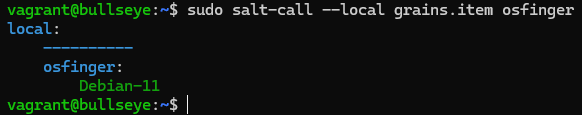

# h1 Viisikko

Sisällysluettelo/Viikon 1 tehtävälistaus:

- x)[ Lue ja tiivistä](#x-lue-ja-tiivistä)
- a)[ Hello Windows](#a-hello-windows)
- b)[ Hello Vagrant!](#b-hello-vagrant)
- c)[ Uusi virtuaalikone vagrantilla](#c-uusi-virtuaalikone-vagrantilla)
- d)[ Saltin asennus virtuaalikoneelle](#d-saltin-asennus-virtuaalikoneelle)
- e)[ Viisi tärkeintä](#e-viisi-tärkeintä)
    - [ pkg](#pkg)
    - [ file](#file)
    - [ service](#service)
    - [ user](#user)
    - [ cmd](#cmd)
- f)[ Indempotentti](#f-indempotentti)
- [Fyysinen tietokone](#fyysinen-tietokone)
- [Lähdeluettelo](#lähteet)

Kaikki tämän dokumentin tehtävät on saatu Tero Karvisen kurssisivulta(Karvinen 2024)

---

## Fyysinen tietokone

- Windows 11 Home
  - Versio: 23H2
- Nvidia rtx 2060 näytönohjain
  - 6 GB muistia
- Intel i7-9750H prosessori
  - 6 ydintä
- 2 x 8GB Ram
- 1000 GB NVMe m.2 SSD
  - Josta vapaana +700Gb
- Viimeisimmät päivitykset ja ajurit asennettuna 28.3.2024

---

## x) Lue ja tiivistä
Tässä Osiossa tein tiivistelmän kolmesta eri Tero Karvisen kirjoittamasta artikkelista.

1. Run Salt Command Locally (Karvinen 2021)
    - Salt on hyödyllinen harjoitteluun, testaukseen sekä nopeaan käyttöönottoon
    - Samat funktiot toimivat Linuxilla ja Windowsilla
    - Viisi tärkeintä funtiota on pkg, file, service, user ja cmd

2. Run Create a Web Page Using Github (Karvinen 2023) 
    - Artikkelissa käydään aloittelijoille läpi hyvin yksityiskohtaisesti, kuinka GitHubiin voidaan julkaista julkinen sivu seuraavassa järjestyksessä:
        1. kirjautuminen
        2. Luodaan repository
        3. Luodaan uusi tiedosto .md muodossa
        4. Kirjoitetaan sisältö
        5. Commit new file 

3. Raportin kirjoittaminen (Karvinen 2006)  
    - Raporttia tulee kirjoittaa kokoajan samalla kun tekee
    - Raportoinnissa kerrotaan täsmällisesti mitä on tehty ja mitä sen jälkeen tapahtui
    - Raportin tulee olla toistettava ja toistettavuuden takia tulee ilmoittaa myös ajoympäristö
    - Raportin tulee olla täsmällinen ja esimerkiksi kellonajat ovat tärkeitä, jotta voidaan selvittää eri työvaiheisiin mennyt aika.
    - Raportin täsmällisyys tulee varmistaa testaamalla. Jos toimii, miten toimivuus on testattu. Sama myös virhetilanteissa.
    - Raportin tulee olla helppolukuinen: huolelliseen kirjoitukseen, selkeään väliotsikointiin ja siistiin ulkoasuun kannattaa panostaa aikaa.
    - Lähteisiin tulee aina viitata. Esimerkki viittaus: `Karvinen, T. 2024. Infra as Code - Palvelinten hallinta 2024. Luettavissa: https://terokarvinen.com/2024/configuration-management-2024-spring/. Luettu: 28.3.2024` ja lähdeviite tekstiin on silloin `Karvinen 2024`
    - Raportin tulee olla totuudenmukainen, Siihen **EI** saa lisätä asioita, mitä ei ole oikeasti tehnyt.

---

## a) Hello Windows
Osiossa oli tarkoitus näyttää, että olen onnistunut Saltin asentamisessa. Sain tunnilla jo asennettua saltin, joten todensin sen toiminnan seuraavasti:
1. Aloitin käynnistämällä Powershellin kirjoittamalla windowsin hakuun powershell ja painoin `Run as administrator`
2. Kirjoitin komennon `salt-call --local grains.item osfullname username`, joka näyttää käyttöjärjestelmän nimen sekä käyttäjätunnukseni  
    

---

## b) Hello Vagrant
Osiossa oli tarkoitus näyttää, että onnistuin vagrantin asennuksessa. Olin asentanut Vagrantin ja bookwormin jo aiemmalla kurssilla, joten tunnilla asensin bullseyen. 
1. Avasin Windows Poweshellin normaalina käyttäjänä
2. `cd bullseye`
3. `vagrant up` <-- Käynnistin tietokoneen, tähän meni muutama minuutti
4. `vagrant ssh` <-- Loin ssh yhteyden
5. Tein uuden kansion, siirryin sinne jonka jälkeen poistuin `exit` komennolla ja tuhosin virtuaalikoneen komennolla `vagrant destroy`. Virtuaalikoneen tuhoamisesta varmistuin sillä, että se oli kadonnut virtualboxista.  
    

---

## c) Uusi virtuaalikone vagrantilla
Tehtävänä oli asentaa uusi virtuaalikone Vagrantilla, joka onnistui seuraavin askelin:  
1. Avasin Windows Poweshellin normaalina käyttäjänä
2. `cd bullseye`
3. `vagrant up` <-- Käynnistin tietokoneen, tähän meni muutama minuutti
4. Tällä kertaa varmistin asennuksen katsomalla, että se oli tullut virtualboxiin  
    

---

## d) Saltin asennus virtuaalikoneelle
Osiossa tuli asentaa salt virtuaalikoneelle, joten tämä on jatkoa suoraan C osiosta. 
1. `vagrant ssh` <-- Otin yhteyden tehtyyn virtuaalikoneeseen
2. `sudo apt-get update` <-- Hain päivitykset
3. `sudo apt-get install salt-minion` <- Asensin saltin
4. Testasin toiminnon komennolla `sudo salt-call --local grains.item osfinger`  
    

---

## e) Viisi tärkeintä
Tehtävänä oli näyttää esimerkit ja analysoida niiden tulokset viidestä tärkeimmästä Salt funktiosta Linuxilla:`pkg`, `file`, `service`, `user` ja `cmd`. Kaikki komennot on Tero Karvisen artikkelista *Run Salt Command Locally*(Karvinen 2021)

### pkg
Pkg komennon avulla voidaan hallinnoida pakettien asennusta (WMware 2024a).
- Ajoin komennon `sudo salt-call --local -l info state.single pkg.installed tree` jonka tarkoituksena oli asentaa `tree`  
    
    >ID: tree = Paketti mitä yritetään asentaa  
    >Function: pkg.installed = Mitä funktiota käytetään  
    >Result: True = Onnistuiko funktion ajaminen  
    >Duration = Kauanko komennon ajaminen kesti  
    >Changes = Mitä muutoksia tehtiin, nyt tuli uusi osioon `1.8.0-1+b1` eli tällainen luotiin   
    >Summary for local = Kertoo onnistumiset ja epäonnistumiset  
    >Total states run = Montako asiaa tehtiin  

### file
File komennon avulla hallinnoidaan tiedostoja (WMware 2024b).
- Ajoin komennon `sudo salt-call --local -l info state.single file.managed /tmp/testikansio` joka luo kansioita  
      
    >ID: /tmp/testikansio = Mikä kansio halutaan luoda  
    >Function: file.managed = Mitä funktiota käytetään  
    >Result: True = Onnistuiko funktion suoritus  
    >Comment: Empty file = Kommentti mitä tehdään  
    >Changes = Kertoo tehdyistä muutoksista  
    >Summary for local = Kertoo onnistumiset ja epäonnistumiset  
    >Total states run = Montako asiaa tehtiin  

### service
Service komennon avulla voidaan määritellä palveluita päälle tai pois päältä (WMware 2024c).
- Ajoin komennon `sudo salt-call --local -l info state.single service.running apache2 enable=True` jonka on tarkoitus käynnistää apache. Sitä ei ole asennettuna.  
      
    >ID: apache2 = Mitä funktio koskee  
    >Function: service.running = Mitä funktiota käytetään  
    >Result: False = Onnistuiko funktion ajaminen  
    >Comment: The named service apache2 is not available = Odotettu tulos, koska apachea ei ole asennettu  
    >Changes = Ei muutoksia, koska mitään ei voitu tehdä  
    >Summary for local = Kertoo sen, että epäonnistuttiin  

### user
User komennon avulla voidaan luoda ja hallita käyttäjäasetuksia (WMware 2024d).
- Ajoin alkuun komennon `Sudo salt-call --local grains.item username` jotta saan selville käyttäjätunnuksen joka palautti `root`
- Ajoin komennon `sudo salt-call --local -l info state.single user.present root`  
      
    >ID: root = Kertoo mitä funktio koskee  
    >Function: user.present = Funktion nimi  
    >Result: True = Kertoo onnistuiko funktion suoritus  
    >Comment: User root is present and up to date = Komennon kommentti  
    >Changes = Kertoisi jos muutoksia olisi tehty  
    >Summary for local = Kertoo funktion onnistuneen  

- Annoin toisen komennon käyttäjätunnuksen luontiin `sudo salt-call --local -l info state.single user.present testi`  
      
    >Tässä nähdään kommentissa, että uusi käyttäjä luotiin sekä suymmary for local osio osoittaa, että tapahtuma onnistui  

- Testasin onnistumisen luomalla käyttäjätunnukselle uuden kansion  
      

### cmd
Cmd komennon avulla voidaan hallinnoida komentojen suoritusta esimerkiksi tiettyjen ehtojen täytyttyä (WMware 2024e).
- Ajoin komennon `sudo salt-call --local -l info state.single cmd.run 'touch /tmp/foo' creates="/tmp/foo"`  
    
    >ID: touch /tmp/foo = Kertoo mitä funktio koskee  
    >Function: cmd.run = Funktion nimi  
    >Comment = kommentti  
    >Changes = Kertoo mitä muutoksia tehtiin  
    >Summary for local = Kertoo funktion onnistuneen  

---

## f) Indempotentti
Tehtävänä oli antaa esimerkki idemptotenssista ajamalla eri `salt-call --local` komentoja, analysoida tuloksia sekä selittää, miten idempotenssi ilmenee.  
Idempotentti voidaan määritellä niin, että jokin komento voidaan suorittaa useaan kertaan niin, että tulos on aina sama (Krimgen 2024).

1. Aikaisemmin asennettiin pkg funktion avulla tree paketti. Voin ajaa sen uudestaan, ilman että mikään muuttuu, joten se on idempotentti funktio. `sudo salt-call --local -l info state.single pkg.installed tree`
    - Ensimmäinen ajokerta:  
        
    - Toinen ja Kolmas ajokerta:
        
Tässä havaitaan se, että ensimmäisellä kerralla muutoksia tehtiin `Changes` kohdan perusteella, mutta toisella ja kolmannella kerralla ei muutoksia tehty, mutta `Summary for local` osio kertoo, että funktiot saatiin ajettua.

---

## g) Tietoa koneesta
Osiossa oli tarkoitus kerätä tietoja koneesta hyödyntäen Saltin grains.itemsiä, poimia kolme kiinnostavaa kohtaa, näyttää tulokset ja analysoida ne. Ajoin alkuun komennoon `sudo salt-call --local grains.items` josta valitsin kolme kiinnostavaa kohtaa. Lopulliseksi komennoksi valikoitui `sudo salt-call --local grains.item username biosversion lsb_distrib_description`
    

1. biosversion
    - Tämä näyttää hauskasti virtualboksin kun kysytään mikä bios versio on käytössä
2. lsb_distrib_description
    - Tämä kertoo kokonaisuudessaan käyttöjärjestelmän version
3. username
    - Kertoo käyttäjätunnuksen nimen 

---

## Lähteet
Krimgen, M. 2024. What Is an Idempotent Operation? Luettavissa: https://www.baeldung.com/cs/idempotent-operations. Luettu: 28.3.2024.

Karvinen, T. 2006. Raportin kirjoittaminen. Luettavissa: https://terokarvinen.com/2012/08/13/2006/raportin-kirjoittaminen-4. Luettu: 28.3.2024.

Karvinen, T. 2021. Run Salt Command Locally. Luettavissa: https://terokarvinen.com/2021/salt-run-command-locally/. Luettu: 28.3.2024.

Karvinen, T. 2023. Run Create a Web Page Using Github. Luettavissa: https://terokarvinen.com/2023/create-a-web-page-using-github/. Luettu: 28.3.2024.

Karvinen, T. 2024. Infra as Code - Palvelinten hallinta 2024. Luettavissa: https://terokarvinen.com/2024/configuration-management-2024-spring/. Luettu: 28.3.2024.

VMware 2024a. SALT.STATES.PKG. Luettavissa: https://docs.saltproject.io/en/latest/ref/states/all/salt.states.pkg.html. Luettu: 28.3.2024.

VMware 2024b. SALT.MODULES.FILE. Luettavissa: https://docs.saltproject.io/en/latest/ref/modules/all/salt.modules.file.html. Luettu: 28.3.2024.

VMware 2024c. SALT.STATES.SERVICE. Luettavissa: https://docs.saltproject.io/en/latest/ref/states/all/salt.states.service.html. Luettu: 28.3.2024.

VMware 2024d. SALT.STATES.USER. Luettavissa: https://docs.saltproject.io/en/latest/ref/states/all/salt.states.user.html. Luettu: 28.3.2024.

VMware 2024e. SALT.STATES.CMD. Luettavissa: https://docs.saltproject.io/en/latest/ref/states/all/salt.states.cmd.html. Luettu: 28.3.2024.
