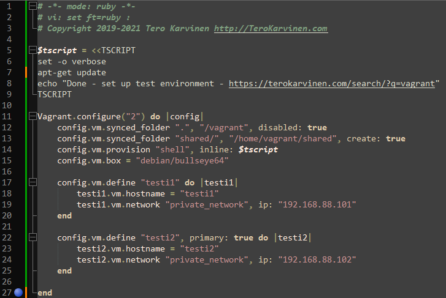

# h2 Soitto kotiin

Kaikki tämän dokumentin tehtävät on saatu Tero Karvisen kurssisivulta(Karvinen 2024a). Olen merkinnyt dokumenttiin aikoja ainoastaan olennaisiksi kokemiini osioihin. Sisällysluettelo/Viikon 2 tehtävälistaus:

- x)[ Lue ja tiivistä](#x-lue-ja-tiivistä)
- a)[ Kaksi virtuaalikonetta](#a-kaksi-virtuaalikonetta)
- b)[ Salt herra-orja](#b-salt-herra-orja)
- c)[ Shell-komento orjalla](#c-shell-komento-orjalla)
- d)[ Useat idempotentti komennot](#d-useat-idempotentti-komennot)
- e)[ Tietojen keräys](#e-tietojen-keräys)
- f)[ Hello, IaC](#f-hello-iac)
- [Fyysinen tietokone](#fyysinen-tietokone)
- [Lähdeluettelo](#lähdeluettelo)

---

## Fyysinen tietokone

- Windows 11 Home
  - Versio: 23H2
- Nvidia rtx 2060 näytönohjain
  - 6 GB muistia
- Intel i7-9750H prosessori
  - 6 ydintä
- 2 x 8GB Ram
- 1000 GB NVMe m.2 SSD
  - Josta vapaana +700Gb
- Viimeisimmät päivitykset ja ajurit asennettuna 5.4.2024

---

## x) Lue ja tiivistä
Tässä Osiossa tein tiivistelmät kolmesta eri Tero Karvisen kirjoittamasta artikkelista.

##### Two Machine Virtual Network With Debian 11 Bullseye and Vagrant (Karvinen 2021)

- Artikkelissa käytiin läpi aluksi, kuinka asennetaan vagrant
- Uudelle projektille kannattaa aina tehdä uusi hakemisto
- Vagrantfile on tiedosto, mihin saa tehtyä konfiguraatioita virtuaalikoneisiin liittyen.
- Ohjeet olivat todella yksinkertaiset ja suoraviivaiset, mutta omaa aikaa tulee luultavasti viemään paljon selvittely siitä, mitä kaikkea tuohon vagrantfileen saa kirjoitettua

##### Salt Quickstart – Salt Stack Master and Slave on Ubuntu Linux (Karvinen 2018)

- Saltin avulla voidaan kontrolloida tuhansia tietokoneita
- Artikkeli käy läpi kuinka asennetaan Saltin herra ja huomaututetaan, että jos on tulimuuri asennettuna, tulee portit 4505/tcp ja 4506/tcp avata
- Seuraavana käydään läpi Saltin orjan asennus, jossa olennaisin osa on se, että tulee tietää herran osoite
- Orjan yhteydenottoyrityksen jälkeen herran tulee hyväksyä avain komennolla `sudo salt-key -A`
- Tämän jälkeen herralla tulisi pystyä ajamaan komentoja orjalle esimerkiksi komennolla `sudo salt '*' cmd.run 'hostname -I'` 

##### Hello Salt Infra-as-Code (Karvinen 2024b)

- Artikkelin alussa käytään läpi Saltin ja micron asennus
- Komennolla `sudo mkdir -p /srv/salt/hello/` luodaan "hello "kansio moduulille, joka on jaettu kaikille orjille
- Hello kansio pitää sisällään kaiken kyseiseen moduuliin liittyvän tiedon
- Moduulin "hello" suorituksen aloituspiste on tiedosto nimeltä `init.sls` kansiossa `hello/` jota voidaan muokata komennolla `sudoedit init.sls` kunhan ollaan hello kansiossa
- Kun init kansioon on lisätty koodia, voidaan se suorittaa komennolla `sudo salt-call --local state.apply hello`
- Lopputuloksen onnistuminen kannattaa aina varmentaa
- Kokonaisuudessaan artikkeli oli yksinkertainen ja helppolukuinen ohje, jonka avulla pääsee helposti tutustumaan infrakoodin luomiseen

---

## a) Kaksi virtuaalikonetta
Tehtävänä oli asentaa kaksi virtuaalikonetta samaan verkkoon ja todentaa niiden toiminnan.

1. Aloitin avaamalla terminaalin adminina
2. Tein kansion kaksikonetta ja siirryin siihen komennoilla `mkdir kaksikonetta; cd kaksikonetta`
3. Kirjoitin komennon `start notepad++ vagrantfile` ja lisäsin sinne koodin, joka konfiguroi vagrant virtuaalikoneet. Olennaisimpana asiana on se, että koodissa määritellään kaksi virtuaalikonetta, testi1 ja testi2 ja näille asetetaan tietyt yksityiset IP-osoitteet.
    
4. Kirjoitin `vagrant ssh testi1`, mutta ensinhän piti laittaa koneet rullaamaan komennolla `vagrant up`
5. Asennukseen meni noin 2 minuuttia ja [tästä](vagrantup.txt) näkee kokonaan terminaalin toiminnan
6. Todensin toiminnan kirjautumalla molemmille virtuaalikoneille SSH yhteyden avulla, ja testasin pingata virtuaalikoneilla toisilleen ja testi1 virtuaalikoneella myös Googleen:  
    

##### Osion lähteet: (Karvinen 2021)

---

## b) Salt herra-orja
Tehtävänä oli asentaa Saltin herra-orja arkkitehtuuri toimimaan virtuaalisen verkon yli ja todentaa toimivuus.

1. Käytin osiossa edellisen tehtävän virtuaalikoneita testi1 ja testi2, johon olin kirjautunut ssh yhteydellä. Tein testi1 koneesta masterin komennolla `sudo apt-get -y install salt-master` jonka asennus vei noin minuutin ja otin ip osoitteen ylös komennolla `hostname -I` joka oli `10.0.2.15 192.168.88.101`
2. Testi2 koneelle asensin orjan komennolla `sudo apt-get -y install salt-minion` jonka asennus vei myös noin minuutin. Asennuksen jälkeen komennolla `sudoedit /etc/salt/minion` ja kirjoitin ylimmälle riville `master: 10.0.2.15` ja tämän alle `id: testi2`
3. Otin muutokset käyttöön testi2 koneella antamalla komennon `sudo systemctl restart salt-minion.service`
4. Mitään ei tapahtunut, kun kokeilin testi1 koneella komentoa `sudo salt-key -A` joten vaihdoin ip osoitteen osioon kaksi `master: 192.168.88.101` jonka jälkeen `sudo systemctl restart salt-minion.service`
5. Testi1 koneella annoin komennon `sudo salt-key -A`  
    
6. Todensin toiminnan antamalla testi1 koneella  komennot `sudo salt '*' cmd.run 'whoami` ja `sudo salt '*' cmd.run 'hostname -I'`  
    

##### Osion lähteet: (Karvinen 2018)

---

## c) Shell-komento orjalla
Tehtävänä oli ajaa shell-komento orjalla Saltin master-slave yhteyttä käyttäen.

1. Ajoin komennon testi1 eli masterilla `sudo salt '*' cmd.run 'ls -l /home/*'` joka palautti:  
    

2. Todensin tämän antamalla saman komennon testi2 koneelle `ls -l /home/*`  
    

---

## d) Useat idempotentti komennot
Tehtävänä oli ajaa useita idempotentteja komentoja master-slave yhteyttä käyttäen. Idempotentit komennot olivat tuttuja jo edelliseltä viikolta(NicklasHH 2024)

1. Ajoin komennon testi1 eli master koneella `sudo salt '*' -l info state.single pkg.installed micro` eli asensin micron testi2 koneelle.
2. Todensin asennuksen onnistumisen ajamalla komennon `micro testi.txt` testi2 koneella, joka avasin micron, joten asennus onnistui. Myös testi1 eli master näytti, että asennus onnistui:  
    
3. Kun asennus on tehty, ei komento enään tee mitään, mutta se ajetaan onnistuneesti:  
    

4. Testasin vielä asentaa tree paketin komennolla `sudo salt testi2 state.single pkg.installed tree` ja ensimmäisellä kerralla se asentui, toisella kerralla komento onnistui, mutta mitään ei asennettu:   
    

5. Todensin asennuksen vielä testi2 koneella:  
    

##### Osion lähteet: (NicklasHH 2024)

---

## e) Tietojen keräys
Tehtävänä oli kerätä tietoja orjista grains.item komentoa hyödyntäen.

1. Annoin komennon `sudo salt testi2 grains.items` joka listaa kaikki mahdolliset itemit. 
2. Annoin komennon, jolla listasin itseäni kiinnostavat tiedot `sudo salt testi2 grains.item groupname host kernel lsb_distrib_description`  
    

---

## f) Hello, IaC
Tehtävänä oli kirjoittaa koodi polkuun `/srv/salt/init.sls` ja ajaa se orjalle. Esimerkkinä oli annettu tiedoston tekeminen hakemistoon, jonka jälkeen tuli varmentaa toisella komennolla, että tiedosto tehtiin.

1. Aloitin osion asentamalla micron testi1 koneelle komennolla `sudo apt-get -y install micro` ja asensin sen oletukseksi komennolla `export EDITOR=micro`
2. Tein moduulin ´testimoduuli´ komennolla `sudo mkdir -p /srv/salt/testimoduuli/` ja siirryin siihen komennolla `cd /srv/salt/testimoduuli/`
3. Avasin init.sls tiedoston komennolla `sudoedit init.sls` ja lisäsin sinne koodia, joka luo kansion `testikansio` polkuun `/tmp/`  
    
4. Ajoin komennon `sudo salt testi2 state.apply testimoduuli` joka näytti, että luotiin uusi kansio:  
    

5. Todensin kansion olemassaolon vielä testi2 koneella:  
    

6. Ajoin vielä uudestaan herralla komennon `sudo salt testi2 state.apply testimoduuli` ja koska kansio oli jo luotu, ei mitään tehty vaikka komento ajettiinkin onnistuneesti:  
    

##### Osion lähteet: (Karvinen 2024b)

---

## Lähdeluettelo

Karvinen, T. 2018. Salt Quickstart – Salt Stack Master and Slave on Ubuntu Linux. Luettavissa: https://terokarvinen.com/2018/salt-quickstart-salt-stack-master-and-slave-on-ubuntu-linux/. Luettu: 7.4.2024.

Karvinen, T. 2021. Two Machine Virtual Network With Debian 11 Bullseye and Vagrant. Luettavissa: https://terokarvinen.com/2021/two-machine-virtual-network-with-debian-11-bullseye-and-vagrant/. Luettu: 7.4.2024.

Karvinen, T. 2024a. Infra as Code - Palvelinten hallinta 2024. Luettavissa: https://terokarvinen.com/2024/configuration-management-2024-spring/. Luettu: 7.4.2024.

Karvinen, T. 2024b. Hello Salt Infra-as-Code. Luettavissa: https://terokarvinen.com/2024/hello-salt-infra-as-code/. Luettu: 7.4.2024.

NicklasHH 2024. f) Indempotentti. Luettavissa: https://github.com/NicklasHH/Palvelinten-hallinta/blob/master/h1%20Viisikko/h1%20Viisikko.md#f-indempotentti. Luettu: 7.4.2024.