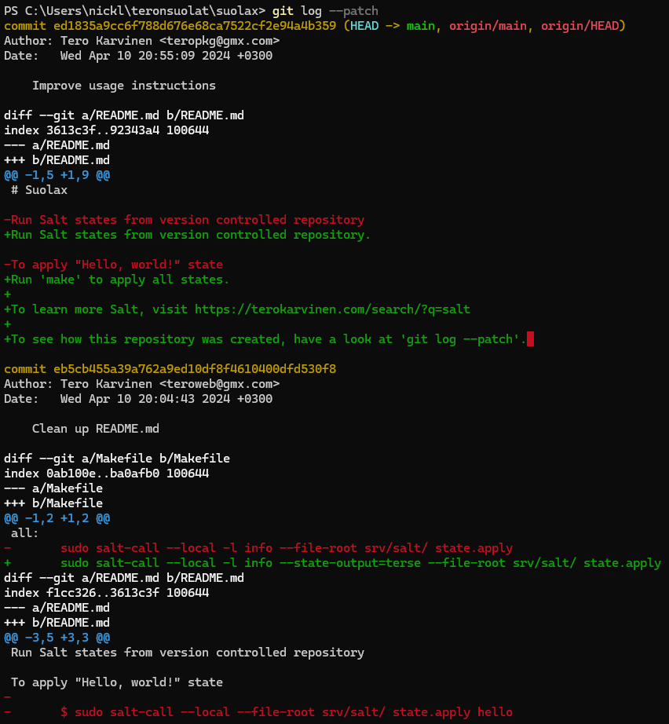
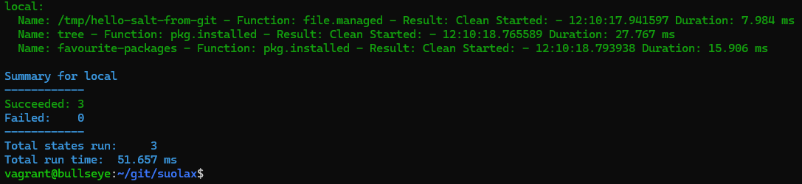

# h3 Toimiva versio

Koska viikon tehtävät liittyvät isolta osin Gittiin ja GitHubiin, esitiedoksi haluan mainita, että Gitin käyttö on tuttua ja sitä tulee käytettyä omien tehtävien tekemiseen sekä olen käyttänyt sitä ryhmätöissä aika paljon.

Tehtävien tekeminen onnistui ulkomuistista poislukien yksittäisiä osioita, joihin on lähde merkattu erikseen. Osiota käytiin läpi 10.4.2024 Tero Karvisen Palvelinten hallinta kurssilla, josta tein omia muistiinpanoja.(Karvinen 2024)

Kaikki tämän dokumentin tehtävät on saatu Tero Karvisen kurssisivulta(Karvinen 2024). Olen merkinnyt dokumenttiin aikoja ainoastaan olennaisiksi kokemiini osioihin. Sisällysluettelo/Viikon 3 tehtävälistaus:

- x)[ Lue ja tiivistä](#x-lue-ja-tiivistä)
- a)[ Online](#a-online)
- b)[ Dolly](#b-dolly)
- c)[ Doh!](#c-doh)
- d)[ Tukki](#d-tukki)
- e)[ Suolattu rakki](#e-suolattu-rakki)
- f)[ Vapaaehtoinen: Se toinen järjestelmä](#f-vapaaehtoinen-se-toinen-järjestelmä)
- g)[ Vapaaehtoinen: yhteistyötä](#g-vapaaehtoinen-yhteistyötä)
- [Fyysinen tietokone](#fyysinen-tietokone)
- [Lähdeluettelo](#lähdeluettelo)

---

## Fyysinen tietokone

- Windows 11 Home
  - Versio: 23H2
- Nvidia rtx 2060 näytönohjain
  - 6 GB muistia
- Intel i7-9750H prosessori
  - 6 ydintä
- 2 x 8GB Ram
- 1000 GB NVMe m.2 SSD
  - Josta vapaana +700Gb
- Viimeisimmät päivitykset ja ajurit asennettuna 11.4.2024

---

## x) Lue ja tiivistä

### 1.3 Getting Started - What is Git? (Chacon and Straub 2014)
Tehtävänä oli lukea ja tiivistää Gitin käyttöopasta kohdasta `1.3 Getting started`
- Lähes jokainen operaatio on paikallinen. Esimerkiksi historian selvittäminen ei tarvitse internet yhteyttä.  
- Gitissä tallennettu tieto tarkistetaan ennen tallentamista ja näin Git havaitsee kaikki muutokset ja tieto pysyy eheänä.  
- Gitin snapshotin ansiosta on vaikea menettää tietoja, jos lähetät säännöllisesti muutokset sinne. 
- Gitissä on kolme tilaa:  
    - Modified: Tila jossa tiedostoja on muokattu, mutta tiedostoja ei ole vielä lisätty tietokantaan  
    - Staged: Tila jossa merkitään muokatut tiedostot nykyisessä versiossa  
    - Committed: Tila jossa tiedostot ovat tallennettu tietokantaan  
- Gitin käyttö menee pääsääntöisesti seuraavasti
    - Tiedostoja muokataan  
    - Valitaan mitkä muutokset halutaan tallentaa
    - Tallennetaan muutokset
### Git add . && git commit; git pull && git push
Tehtävänä oli avata komennon `Git add . && git commit; git pull && git push` jokainen osa.
- Git add .  
    - Komento lisää kaikki tiedostot indeksiin  
    - Mahdollista on lisätä myös yksittäisiä tiedostoja komennolla `git add <haluttuTiedosto>`
- git commit  
    - Komento sitoo indeksiin lisätyt tiedot uuteen solmuun  
    - Erikseen voi antaa komennon `git commit -m "haluttu teksti"` jossa voidaan suoraan antaa haluttu viesti.  
- git pull  
    - Komento hakee etärepositoriosta kaikki muutokset paikalliseen hakemistoon  
- git push 
    - Komento lähettää paikalliset muutokset etärepositorioon   

##### Osion lähteet: (Polvinen 2020)

### terokarvinen/suolax/ historia (terokarvinen 2024)
Tehtävänä oli selittää [terokarvinen/suolax/](https://github.com/terokarvinen/suolax/) loki ja muutokset

- Yritin aluksi katsoa muutoslokia suoraan githubista, mutta koska siellä ei paljoa ole kerrottavaa, tein osiosta kloonin itselleni. 
    

1. Annoin alkuun komennon `git log` joka näytti jokaisen muutoksen samalla tavalla kuin yllä oleva kuva GitHubista sillä erolla, että author on tarkemmin muotoa `Tero Karvinen <teropkg@gmx.com>`
2. Annoin komennon `git log --patch` ja pääsin syventymeen tarkemmin muutoksiin.
    - Muutoksia on tehty paljon, joten käyn läpi esimerkin:
        
    - Author osio kertoo muokkaajan  
    - Date osio kertoo muokkaamis päivämäärän  
    - Commit message  
    - Kerrotaan missä tiedostossa on muutoksia  
    - Kerrotaan mitä tiedostossa on muokattu, punainen teksti on poistettu (tai - tektin edessä) kun taas vihreä (tai + tekstin edessä) kertoo lisätystä asiasta.  
    - Logista siis näkee yksityiskohtaisesti kuka teki, milloin teki, mitä teki ja minne teki.  
3. Kun katsoin tuota `git log --patch` osiota, näytti se aivan samalta kun commitin tarkistelu suoraan gitistä, joten tämän olisin sittenkin voinut tehdä sieltä suoraan.   
    **Terminaalin versio:**   
      
      
    **GitHubin versio**   
      

##### Osion lähteet: (Karvinen 2024)
---

## a) Online
Tehtävänä oli tehdä uusi varasto GitHubiin. Varasto tuli nimetä niin, että nimessä ja kuvauksessa on sana `summer`
1. Aloitin tehtävän menemällä osoitteeseen https://github.com/NicklasHH jossa painoin yläreunasta `Repositories`
2. Auenneelta sivustolta painoin oikeasta yläreunasta vihreää `New` painiketta
3. Täysin tiedot kohtiin `Repository name`, `Description`, täpän kohtaan `Add README file` ja lisäsin lisenssin jonka jälkeen painoin `Create repository`  
      
4. Osio on tehty ja löytyy osoitteesta https://github.com/NicklasHH/summer-task  
      

##### Osion lähteet: (Karvinen 2024)

---

## b) Dolly
Tehtävänä oli kloonata edellisen osion varasto paikalliseksi, tehdä siihen muutoksia ja puskea muutokset takaisin GitHubiin ja lopuksi varmentaa, että ne meni GitHubiin.

1. Avasin terminaalin painamalla windows- ja X merkkiä jossa painoin `Terminal`
2. Loin uuden kansion ja siirryin siihen komennolla `mkdir Task_3; cd Task_3`
3. Githubissa saa kloonausta varten osoitteen repositoryn `<> Code` osiosta ja koska käytössä on SSH kopioin `SSH` osiosta kloonausta varten osoitteen `git@github.com:NicklasHH/summer-task.git`
5. Annoin kloonausta varten terminaalissa komennon `git clone git@github.com:NicklasHH/summer-task.git`
    
6. Siirryin kansioon komennolla `cd .\summer-task\`
7. Annoin komennon `notepad newFile.txt` ja avautuneeseen ikkunaan vastasin `Kyllä`
    
8. Kirjoitin tiedostoon `vähän uutta tekstiä` ja tallensin sen
9. Annoin seuraavat komennot
  >git add .  
  >git git commit -m "Add new textfile"  
  >git push  
    
10. Tarkistin, näkyykö uusi tiedosto sisältöineen GitHubin repositoryssä ja se löytyy osoitteessa https://github.com/NicklasHH/summer-task/blob/main/newFile.txt

##### Osion lähteet: (Karvinen 2024)

---

## c) Doh!
Tehtävänä oli tehdä gittiin jokin huono muutos, jonka jälkeen hakea vanha versio gitistä komennolla `git reset --hard`

1. Polussa `C:\Users\nickl\Task_3\summer-task` kirjoitin komennon `notepad newFile.txt`
2. Kirjoitin tiedostoon uudelle riville: `typerä muutos` ja tallensin tiedoston
3. Annoin komennon `git reset --hard` ja palautuksena sain varmistuksen, että haettiin GitHubista viimeisin versio `HEAD is now at aff17e0 Add new textfile`
4. Kirjoitin taas `notepad newFile.txt` josta oli kadonnut rivi `typerä muutos`

##### Osion lähteet: (Karvinen 2024)

---

## d) Tukki
Tehtävänä oli tutkia ja selittää varastoni lokia ja tarkistaa nimen ja sähköpostin näkyminen haluamallani tavalla.

1. Ensimmäisenä tarkistin, että nimi ja sähköposti on kuten haluan niiden olevan 
    
    - Jos haluaisin muuttaa niitä, se onnistuisi komennoilla   
      - git config --global user.name "uusinimi"  
      - git config --global user.email "uusiSposti"  
2. Testasin komentoa `git log` jolla näin repositoryssä tehdyt muutokset
    
    - Ensimmäisellä rivillä näkyy annettu komento  
    - `commit` kohta kertoo muutoksen ID:n  
    - `Author` kertoo kuka teki muutokset  
    - `Date` Muutoksen aika  
    - sen jälkeen tulee commit message  
    - Huomiona se, että commitin perässä oleva `HEAD` kertoo sen, missä kohdassa ollaan  
3. Log komentoon voi antaa myös lisämääreitä, kuten `git log --patch` jolla näen mitä on lisätty missäkin commitissa.
    

##### Osion lähteet: (Karvinen 2024)

---

## e) Suolattu rakki
Tehtävänä oli ajaa Salt-tiloja, käytin tehtävässä Teron tunnilla tekemää varastoa https://github.com/terokarvinen/suolax jonka kloonasin paikalliseksi varastokseni.

1. Avasin terminaalin adminina ja siirryin kansioon bullseye
2. Annoin komennon `vagrant up` ja odotin asennusta noin minuutin
3. Annoin komennon `vagrant ssh`
4. Annoin komennon `sudo apt-get update` ja `sudo apt-get install salt-minion` ja tarkistin asennuksen komennolla `sudo salt-call --local grains.item osfinger` joka palautti vastaukseksi `Debian-11`
5. Tein ssh-avaimen komennolla `ssh-keygen` ja kopioin ssh avaimen jonka sain komennolla `/home/vagrant/.ssh/id_rsa.pub`
6. Menin GitHubiin ja painoin oikeassa yläreunassa profiilini kuvaa josta avautui valikko mistä valitsin `Settings` jonka jälkeen valitsin vasemmasta reunasta osion `SSH and GPG keys`
7. Painoin oikean yläkulman vihreää `New SSH key` ja annoin Title osioon `virtuaalikone` ja lisäsin aikaisemmin kopioidun ssh avaimen ja painoin vihreää `Add SSH key`
8. Tein virtuaalikoneella uuden kansion komennolla `mkdir git` ja siirryin siihen komennolla `cd git`
9. Asensin Gitin komennolla `sudo apt-get install git`
10. Menin teron suolax repositoryyn (osoite: https://github.com/terokarvinen/suolax) jossa painoin vihreää `<> Code` painiketta ja kopioin SSH välilehden osoitteen kloonausta varten
11. Annoin komennon `git clone git@github.com:terokarvinen/suolax.git` ja tässä kohtaa otettiin myös SSH avain käyttöön kysymyksellä `Are you sure you want to continue connecting (yes/no/[fingerprint])?` johon vastasin `yes`
12. Siirryin kloonattuun kansioon komennolla `cd suolax/`
13. Annoin komennon `make` ja sain vastauksena `-bash: make: command not found` joten kirjoitin googleen virheen ja valitsin sieltä githubin keskustelun, jossa ehdotettiin samaan ongelmaan `make` asennusta(RTMDFG 2017) joten annoin komennon `sudo apt-get install make`
14. Annoin komennon `make` ja asennukset lähtivät rullaamaan.  
    
15. Tarkistin, mitä kaikkea asennettiin jotta osasin todentaa asennuksien onnistumisen. Kokeilin seuraavia komentoja: 
    > `cmatrix` <-- Lähti rullaamaan vihreää tekstiä  
    > `cowsay moi` <-- Tuli lehmä joka sanoi `moi`  
    > `ls /tmp` <-- Palautti tulosteen, jossa näkyy polusta löytyvän kansio `hello-salt-from-git` kuten kuuluukin  
    > `tree` <-- palautti alla olevan  
    
16. Voidaan todeta, että asennukset onnistuivat. Ajoin komennon vielä kerran ja edelleen ajaminen onnistui, mutta mitään ei asennettu.  
    

##### Osion lähteet: (RTMDFG 2017, Karvinen 2024, terokarvinen 2024)

---

## f) Vapaaehtoinen: Se toinen järjestelmä
Tämä tehtävä oli vapaahetoinen. Tehtävänä oli kokeilla Gittiä eri käyttöjärjestelmien kanssa. Tarkoitus oli selittää käyttö niin, että järjestelmää osaamatonkin saa tehtyä samat toimenpiteet. En ole koskaan käyttänyt fedoraa, mutta yritän selvitytyä osiosta täysin omatoimisesti testaamalla ainoastaan tietämieni komentojen avulla. Tein tämän osion vasta G osion jälkeen.

1. Asensin Fedoran
    - Avasin terminaalin ja tein uuden kansion ja siirryin siihen `mkdir fedoratesti; cd fedoratesti`
    - Annoin komennon `vagrant init bento/fedora-latest` jonka avulla saan fedoran vagrantiin(HashiCorp 2024)
    - Annoin komennon `vagrant up` kello asennukseen meni alle kaksi minuuttia
    - Annoin komennon `vagrant ssh`  
        
2. SSH-Avain
    - Yritin tehdä SSH avaimen antamalla komennon `ssh-keygen` joka yllätyksekseni onnistui. Painoin enteriä ohittaakseni kysymykset, jolloin avain luotiin vakiokansioon. Julkinen SSH avain löytyi polusta `/home/vagrant/.ssh/id_rsa.pub`  
    - Annoin komennon `cat /home/vagrant/.ssh/id_rsa.pub` ja kopioin tulosteen.  
    - Menin osoitteeseen www.github.com ja oikeasta yläkulmasta klikkasin profiilikuvaani ja avautuneesta valikosta valitsin `Settings`  
    - Vasemmasta reunasta valitsin `SSH and GPG Keys`  
    - Oikeasta yläreunasta painoin vihreää `New SSH key`  
    - Title osioon kirjoitin `fedora` jolla tunnistan mihin avain liittyy  
    - Key osioon kopioin aikaisemmin tallentamani julkisen SSH avaimen
    - Painoin vihreää `Add SSH key`
    - Syötin vielä GitHubin kysymän autentikointikoodin jonka sain puhelimestani

3. Repositoryn kloonaus
    - Menin GitHubissa omaan profiiliini ja valitsin vasemmasta yläreunasta `Repositories` ja siirryin repositorioon `summer-task` klikkaamalla sitä
    - Painoin ylhäällä oikealla olevaa `<> Code` painiketta ja valitsin `SSH` välilehden josta kopioin kloonaus osoitteen `git@github.com:NicklasHH/summer-task.git`
    - Kirjoitin Fedoralla komennon `git clone git@github.com:NicklasHH/summer-task.git` ja sain vastauksena `-bash: git: command not found` ja päättelin, että git pitää asentaa
    - Yritin ensin komennolla `sudo apt-get update` mutta apt-get ei toimi fedoralla, joten Googlasin hakusanalla `fedora install git` ja siirryin GitHubin linkkiin (GitHub S.A.) josta löysin koodin `sudo dnf install git-all` jota testasin. Asennus lähti rullaamaan ja samalla asennettiin riippuvuudet. Kokonaisuudessaan asennukset veivät noin 3 minuuttia ja päättyivät riviin `Complete!`  
    - Kokeilin uudelleen komentoa `git clone git@github.com:NicklasHH/summer-task.git` ja koska kyseessä on ensimmäinen SSH kirjautuminen, valitsin `yes` kohtaan, missä kysyttiin `This key is not known by any other names. Are you sure you want to continue connecting (yes/no/[fingerprint])?`
    - Tarkistin, onko tiedostorakenne oikeanlainen:  
         
4. Muutoksien tekeminen
    - Yritin muokata README.MD tiedostoa komennoilla `nano readme.md`, `micro readme.md` ja `notepad readme.md` joten seuraavaksi yritin asentaa micron komennolla `sudo dnf install micro` ja kirjoitin `y` ja enter
    - Muutaman sekunnin asennuksien jälkeen tuli tuttu `Complete!`
    - Ajoin uudelleen komennon `micro readme.md` ja micro avautui. 
    - Avautunut tiedosto oli kuitenkin tyhjä, joten suljin sen ja annoin uudelleen komennon kirjoittamalla tiedoston nimen tarkalleen oikein `micro README.md` jolloin avautui micro missä oli teksti, joka sinne kuului. Lisäsin tekstin `Tehty fedoralla` uudelle riville, tallensin ja suljin tiedoston. 
    - Annoin komennot `git add .`, `git commit -m "new line with fedora"` jolloin sain ilmoituksen, että minun tulee antaa tietoja itsestäni  
        
    - Annoin komennot `git config --global user.name "Nicklas Fedoralla"` ja `git config --global user.email "nicklas.akerman@myy.haaga-helia.fi"`
    - Kokeilin uudelleen komentoa `git commit -m "new line with fedora"` joka palautti  
        >[main 78a58f8] new line with fedora  
        >1 file changed, 1 insertion(+)  
    - Annoin vielä komennon `git push` ja varmistin, että siellä näkyy muutokset README.md tiedostossa  
      
    - Ulkoasu oli kuitenkin väärä = riviä ei ollut vaihdettu, joten komennolla `micro README.md` avasin vielä readme tiedoston ja lisäsin kaksi välilyöntiä sanan `summer` perään ja tallensin tiedoston
    - Kokeilin antaa komennon `git add . && git commit -m "Edit README.md"; git push` ja nyt GitHubissa oli halutunlainen ulkoasu  
      
5. Lopuksi katsoin vielä paiksellisella koneella logia
    - Ensin hain muutokset komennolla `git pull`  
    - Annoin komennon `git log` ja muutokset näkyivät logissa. Varmennuksena se, että nimenä on `Nicklas Fedoralla`
      
##### Omia havaintoja
Linux-palvelimet ja Palvelinten-hallinta kurssilta opitut komennot toimivat hyvin pitkälti myös Fedoralla. Tässä osiossa ainoastaan dnf oli eroavaisuutena aikaisemmin käyttämäni debianin apt-get komentoon.

##### Osion lähteet: (HashiCorp 2024, GitHub S.A.)
---

## g) Vapaaehtoinen: yhteistyötä
Tämä tehtävä oli vapaahetoinen. Tehtävänä oli antaa kaverille kirjoitusoikeus varastooni, jonka jälkeen molemmat tekee muutoksia varastoon gitillä. Tein osion ennen F osiota.

1. Ollessani summer-task repositoryssä, valitsin oikelta ylhäältä `Settings`
2. Avautuneelta sivulta valitsin vasemmasta reunasta `Collaborators`
3. Painoin vihreää `Add people`
4. Lisäsin tunnuksen `fxi09369@romog.com` jonka tein minutemaililla
5. Toisella tunnuksella oikeasta yläreunasta avasin inboksin, jossa oli kutsu liittyä summer-task repositoryyn jossa painoin `Accept invitation`  
    
6. Tällä uudella käyttäjällä menin osoitteeseen https://github.com/NicklasHH/summer-task jossa painoin oikelta `Add file` jonka jälkeen `Create new file`
7. Lisäsin tiedostolle nimen, laitoin vähän tekstiä ja painoin lopuksi vihreää `Commit changes...`   
    
8. Annoin Commit message osioon `Create toisenTiedosto.md` jonka jälkeen painoin vihreää `Commit changes`
9. Avautui uusi ikkuna ja annoin Commit message osioon `Create toisenTiedosto.md` jonka jälkeen painoin vihreää `Commit changes`  
    
10. Siirryin terminaaliin ja annoin komennon `ls` jolla varmistin, että tällä hetkellä on vain 3 tiedostoa, jonka jälkeen annoin komennon `git pull` hakeakseni muutoksia ja lopuksi katsoin, tuliko uusi tiedosto antamalla `ls` komennon  
    
11. Tarkistin vielä komennolla `git log`, että siellä näkyy, että tiedosto luotiin toisella tunnuksella   
    

##### Osion lähteet: (Karvinen 2024)

---

## Lähdeluettelo

Chacon and Straub 2014. 1.3 Getting Started - What is Git? Luettavissa: https://git-scm.com/book/en/v2/Getting-Started-What-is-Git%3F. Luettu: 14.4.2024.

GitHub S.A. Install Git. Luettavissa: https://github.com/git-guides/install-git. Luettu: 14.4.2024.

HashiCorp 2024. bento/fedora-latest Vagrant box. Luettavissa: https://app.vagrantup.com/bento/boxes/fedora-latest. Luettu: 14.4.2024

Karvinen, T. 2024. Infra as Code - Palvelinten hallinta 2024. Luettavissa: https://terokarvinen.com/2024/configuration-management-2024-spring/. Luettu: 14.4.2024.

Polvinen, T. 2020. Pieni Git-opas. Luettavissa: https://vm.utu.fi/document/fi_pieni-git-opas.pdf. Luettu: 14.4.2024.

RTMDFG 2017. make:command not found #14. Luettavissa: https://github.com/bamarni/pi64/issues/14. Luettu: 14.4.2024.

terokarvinen 2024. suolax. Luettavissa: https://github.com/terokarvinen/suolax. Luettu: 14.4.2024.
