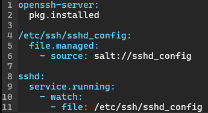

# h4 Demoni

Kaikki tämän dokumentin tehtävät on saatu Tero Karvisen kurssisivulta(Karvinen 2024). Olen merkinnyt dokumenttiin aikoja ainoastaan olennaisiksi kokemiini osioihin. Sisällysluettelo/Viikon 4 tehtävälistaus:

- x)[ Lue ja tiivistä](#x-lue-ja-tiivistä)
- a)[ Hello SLS!](#a-hello-sls)
- b)[ Top.](#b-top)
- c)[ Apache easy mode.](#c-apache-easy-mode)
- d)[ SSHouto](#d-sshouto)
- e)[ Vapaaehtoinen: Apache.](#e-vapaaehtoinen-apache)
- f)[ Vapaaehtoinen: Caddy.](#f-vapaaehtoinen-caddy)
- g)[ Vapaaehtoinen: Nginx.](#g-vapaaehtoinen-nginx)
- [Fyysinen tietokone](#fyysinen-tietokone)
- [Lähdeluettelo](#lähdeluettelo)

---

## Fyysinen tietokone

- Windows 11 Home
  - Versio: 23H2
- Nvidia rtx 2060 näytönohjain
  - 6 GB muistia
- Intel i7-9750H prosessori
  - 6 ydintä
- 2 x 8GB Ram
- 1000 GB NVMe m.2 SSD
  - Josta vapaana +700Gb
- Viimeisimmät päivitykset ja ajurit asennettuna 18.4.2024

---

## x) Lue ja tiivistä

### Karvinen 2023: Salt Vagrant - automatically provision one master and two slaves
Tehtävänä oli lukea ja tiivistää Tero Karvisen artikkelista kaksi kohtaa:  
1. **Infra as Code - Your wishes as a text file**
    - Ensin luodaan tiedostorakennne ja init.sls tiedosto  
    - init.sls on YAML kieltä, jossa sisennyksillä on merkitystä, joten niiden kanssa tulee olla tarkkana ja ne tehdään välilyönnillä(Ei tabilla)  
    - Lopuksi ajetaan tila komennolla `sudo salt '*' state.apply hello` jossa hello on kansion nimi missä init.sls on  
2. **top.sls - What Slave Runs What States** 
    - top.sls määrittelee mitä tiloja ajetaan millekkin orjalle.  
    - top.sls voidaan myös määritellä, mitkä moduulit ajetaan, jolloin niitä ei tarvitse nimetä state.applyn perään  

###### Osion lähteet: (Karvinen 2023)

### Salt contributors: Salt overview
Tehtävänä oli lukea ja tiivistää artikkelin kolme kohtaa: 
1. **Rules of YAML**  
    - YAML kielessä data rakennetaan avain: arvo -pareihin (huomaa välilyönti kaksoispisteen jälkeen)  
    - Avainten arvo voi olla monessa eri rakenteessa  
    - Kaikki avaimet ja ominaisuudet ovat merkkikokoriippuvaisia  
    - YAML käyttää ainoastaan välilyöntiä, ei tabulaattoria sisennyksiin
    - Kommentointi alkaa # -merkillä
2. **YAML simple structure**  
    - YAML koostuu kolmesta perustyypistä: **Scalar**(Skalaari), **Lists**(Lista), **Dictionary**(Sanakirja)  
    - Skalaari sisältää `avain: arvo` -kuvauksen, jossa arvo voi olla numero, merkkijono tai totuusarvo  
    - Lista on `avain:` jota seuraa arvolista, jossa jokainen arvo on omalla rivillä ja jatkuu kahdella välilyönnillä ja yhdysviivalla
    - Sanakirja on kokoelma `avain: arvo` kuvauksia ja listoja
3. **Lists and dictionaries - YAML block structures**  
    - YAML on lohkorakenteisiin järjestetty  
    - Sisennys määrittelee kontekstin, lista ja ominaisuudet **täytyy** sisentää vähintään yhdellä välilyönnillä, mutta standardi on kaksi välilyöntiä
    - Kokoelma joka on lista tai sanakirja sekvenssi, osoittaa jokaisen osion viivan ja välilyönnin avulla: `"- "`    
 ###### Osion lähteet: (VMware S.A.)

### Karvinen 2018: Pkg-File-Service – Control Daemons with Salt – Change SSH Server Port
Tehtävänä oli lukea ja tiivistää artikkeli muutaman ranskalaisen viivan avulla.
- Artikkelin alussa mainitaan, että voin hallita valtavaa määrää demoneita konfiguraationhallintajärjestelmän avulla ja tähän hyvä malli on `Package-file-service` joka korvaa konfiguraatiotiedoston  ja käynnistää demonin uudelleen
- Artikkelissa käydään läpi kuinka Salt-tilan avulla muutetaan SSH-palvelimen porttia  
- Alkutilanne vaatii saltin herra-orja arkkitehtuurin. Masterille tehdään tila (sshd.sls) ja konfiguraatiotiedoston master-kopio(sshd_config)  

1. Ensin luotiin SSH tila
      
2. Sitten muutettiin sshd_config tiedostoon portin numero ja poistettiin kommentit
3. Ajettiin tila orjalle `sudo salt '*' state.apply sshd`
4. Testattiin tapahtuiko muutokset

###### Osion lähteet: (Karvinen 2018)

### Silmäile Saltin ohjeet tilafunktioille pkg, file ja service.
Koska artikkelit ovat pitkiä, tuli lukea johdanto ja silmillä seuraavia komentoja:

1. **sudo salt-call --local sys.state_doc pkg** *johdanto + pkg.installed, pkg.purged, pkgs* 
    - Komennon johdannossa kerrottiin, että salt voi hallita ohjelmistopaketteja pkg-tilan avulla. Paketit voidaan asettaa asennettaviksi, päivitettäviksi, poistettaviksi tai puhdistettaviksi.
    - pkg.installed varmistaa, että haluttu paketti on asennettu ja käytössä on haluttu versionumero  
    - pkg.purged varmistaa, että haluttu paketti ei ole asennettu ja tarvittaessa poistaa paketin ja siihen liittyvät tiedostot
    - pkgs avulla käyttää useita paketteja samaan aikaan

2. **sudo salt-call --local sys.state_doc file** *johdanto + file.managed, file.absent, file.symlink*
    - Komennon johdannossa kerrottiin, että file komennon avulla voidaan tehdä muutoksia kansioihin ja tiedostoihin
    - file.managed avulla voidaan hallita tiedostoja ja kansioita. Tämän avulla voidaan määritellä useita tiedostoon/kansioon liittyviä asetuksia.   
    - file.absent varmistaa että tietty tiedosto puuttuu ja tarvittaessa se poistaa sen.  
    - file.symlink avulla voidaan luoda symbolinen linkki. Jos tiedosto on olemassa ja symlink osoittaa väärää tiedostoa, symlinkki korvataan.

3. **sudo salt-call --local sys.state_doc service** *johdanto + service.running, service.dead, enable*
    - Komennon avulla voidaan käynnistää ja uudelleenkäynnistää palveluita ja demoneita 
    - service.running varmistaa että haluttu palvelu tai demoni on halutussa tilassa. Jos tila ei ole haluttu, asetetaan se haluttuun tilaan.  
    - service.dead varmistaa että haluttu palvelu on pysäytetty ja jos ei ole, se pysäytetään. 
    - enable varmistaa, että järjestelemän käynnistyessä haluttu palvelu on halutussa tilassa. 

---

## a) Hello SLS!
Tehtävänä oli tehdä Hei maailma -tila kirjoittamalla se init.sls tiedostoon.

1. Aloitin tehtävän kopioimalla Tero Karvisen sivuilta vagrantfilen, jonka avulla saan käyttööni kolme virtuaalikonetta. https://terokarvinen.com/2023/salt-vagrant/ ja asetin kopioidun tiedoston paikallisen koneeni bullseye kansion vagrantfile tiedostoon.
2. Avasin terminaalin ja menin bullseye kansioon jossa kirjoitin `vagrant up` ja odotin noin 5 minuuttia, kun kolme tietokonetta käynnistyi.
3. Otin SSH yhteyden masteriin komennolla `vagrant ssh tmaster`
4. Koska kyseessä oli uusi virtuaalikone, annoin komennot `sudo apt-get update`, `sudo apt-get -y install micro curl salt-master` ja `export EDITOR='micro'`
5. Tein kansion init.sls varten komennolla `sudo mkdir -p /srv/salt/hello` ja tein init.sls tiedoston komennolla `sudoedit /srv/salt/hello/init.sls` jonne kirjoitin:  
    
6. Kirjoitin komennon `cd /srv/salt/hello` ja annoin komennon `sudo salt-call --local state.apply hello`
7. Palautuksena tuli, että `/tmp/heippa-maailma` luotiin, joten tarkistin vielä, että se löytyy  
    

###### Osion lähteet: (Karvinen 2023.)

---

## b) Top.
Tehtävänä oli tehdä top.sls tiedosto, jonka avulla ajetaan useita tiloja automaattisesti. Esim komennot   
> sudo salt '*' state.apply  
> sudo salt-call --local state.apply  
1. Jatkoin siitä, mihin edellisessä osiossa jäätiin, joten aluksi loin uuden kansion `sudo mkdir -p /srv/salt/toinenhello` ja tein sinne tilan komennolla `sudoedit /srv/salt/toinenhello/init.sls`:  
    
2. Tein seuraavaksi top.sls tiedoston `sudoedit /srv/salt/top.sls` jonka sisällöksi tuli:  
    
3. Annoin komennon `sudo salt-call --local state.apply` ja palautuksena tuli, että tehtiin uusi `/tmp/heippa-suomi` ja molempien tilojen ajaminen onnistui.  
    
4. Tarkistin vielä manuaalisesti, että heippa-suomi löytyy  
    

###### Osion lähteet: (Karvinen 2024)

---

## c) Apache easy mode.
Tehtävänä oli asentaa Apache ja korvata sen testisivu ja ajaa asianmukaiset testaukset toiminnasta. Työjärjestykenä käsin asennus, tilan kirjoitut sls-tiedostoon, pkg-file-service
1. Aloitin komennolla `sudo apt-get -y install apache2` ja asennuksen jälkeen annoin komennon `curl localhost` jonka avulla todensin apachen olevan päällä
2. Annoin komennon `echo "TestaajaPRO" | sudo tee /var/www/html/index.html` joka korvaa testisivun sisällön
3. Annoin komennon `sudoedit /etc/apache2/sites-available/index.conf` joka sai sisällöksi:  
    
4. Apachen potkasu ja curlaus komennoilla:  
  - `sudo systemctl restart apache2`  
  - `curl localhost` joka vastasi `TestaajaPRO`

**Nyt olen testannut manuaalisen asennuksen, joten voin automatisoida homman:**
1. Aloitin luomalla uuden kansion `sudo mkdir -p /srv/salt/apache`
2. Tein init.sls tiedoston komennolla `sudoedit /srv/salt/apache/init.sls`  
  
3. Lisäsin polkuun /srv/salt tiedoston `index.html` joka sai sisällöksi `TestaajaPRO2`
4. Tässä kohtaa hyväksyin avaimet kahdesta muusta virtuaalikoneesta komennolla `sudo salt-key -A` ja vastasin `Y`
5. Testasin saanko yhteyden molempiin minioneihin komennolla `sudo salt '*' test.ping`
4. Tässä kohtaa kävin kirjautumassa minionille toisella terminaalilla antaen komennon `vagrant ssh t001` ja asensin sille curlin komennoin `sudo apt-get update` ja `sudo apt-get install curl`
5. `curl localhost` kertoi, ettei ollut mitään curlattavaa, joten annoin masterilla komennon `sudo salt 't001' state.apply apache` ja vastauksena sain succeeded: 3 (changed=2)
6. Menin t001 koneelle ja `curl localhost` joka palautti TestaajaPRO2 kuten kuuluikin.
7. Tein saman vielä t002 koneelle
    - sudo apt-get install curl  
    - `curl localhost` (Palautti: `curl: (7) Failed to connect to localhost port 80: Connection refused`)  
    - masterilla komento `sudo salt 't002' state.apply apache`  
    - t002 koneella `curl localhost` (Palautti: `TestaajaPRO2`)

###### Osion lähteet: (Karvinen 2018, Karvinen 2023, Karvinen 2024)

---

## d) SSHouto
Tehtävänä oli lisätä uusi portti, jossa SSHd kuuntelee. 
1. Aloitin homman komennolla `vagrant destroy` bullseye kansiossa, jotta pystyin aloittamaan puhtaalta pöydältä komennolla `vagrant up` ja `vagrant ssh tmaster`
2. Asensin micron ja asetin sen oletuseditoriksi `sudo apt-get -y install micro` ja `export EDITOR='micro'`
3. Hyväksyin testikoneet komennolla `sudo salt-key -A` ja testasin pingata niihin komennolla `sudo salt '*' test.ping`
4. Otin testikoneiden ip ylös komennolla `sudo salt '*' cmd.run 'hostname -I'`:  
    - t001:  
        - 10.0.2.15 192.168.12.100  
    - t002:  
        - 10.0.2.15 192.168.12.102  

5. Loin kansiorakenteen salttia varten komennolla `sudo mkdir -p /srv/salt/`
6. Loin tiedoston `sshd.sls` komennolla sudoedit `/srv/salt/sshd.sls`  
  
7. Muokkasin sshd_config tiedostoa komennolla `sudoedit /etc/ssh/sshd_config` siten, että lisäsin sinne omille riveilleen tekstit `Port 22` ja `Port 1234`

8. Halusin seurata ssh statusta, joka onnistuu komennolla `sudo systemctl status ssh` ja restart onnistuu komennolla `sudo systemctl restart ssh` (Gite 2024)

9. Status kertoi, että ssh ei käynnisty uudestaan kun vaihdan sshd_config tiedoston sisältöä. katsoin uudestaan sshd.sls tiedostoa ja tulin lopputulokseen, että minun tulee kopioida alkuperäinen sshd tiedosto salttiin.

10. Kopioin siis alkuperäisen sshd_config tiedoston komennolla `sudo cp /etc/ssh/sshd_config /srv/salt/` mutta status ei vieläkään muuttunut, vaikka muokkasin molempia `sshd_config` tiedostoja. Testasin myös katsoa ssh statusta t001 koneella, mutta sielläkään ei vaikuta vaikka muokkaan `/etc/ssh/sshd_config` tiedostoa.

###### Osion lähteet: (Karvinen 2018, Karvinen 2024)

---

## e) Vapaaehtoinen: Apache.
Tehtävänä oli asentaa Apache niin, että weppivu näkyy localhostissa, html:n tulee olla kotihakemistossa ja voidaan muokata ilman sudo oikeuksia.
1. 

###### Osion lähteet: (Karvinen 2024)

---

## f) Vapaaehtoinen: Caddy.
Tehtävänä oli asentaa Caddy niin, että weppivu näkyy localhostissa, html:n tulee olla kotihakemistossa ja voidaan muokata ilman sudo oikeuksia.
1. 

###### Osion lähteet: (Karvinen 2024)
---

## g) Vapaaehtoinen: Nginx.
Tehtävänä oli asentaa Nginx niin, että weppivu näkyy localhostissa, html:n tulee olla kotihakemistossa ja voidaan muokata ilman sudo oikeuksia.
1. 
###### Osion lähteet: (Karvinen 2024)

---

## Lähdeluettelo

Karvinen, T. 2018. Pkg-File-Service – Control Daemons with Salt – Change SSH Server Port. Luettavissa: https://terokarvinen.com/2018/pkg-file-service-control-daemons-with-salt-change-ssh-server-port/. Luettu: 18.4.2024.

Karvinen, T. 2023. Salt Vagrant - automatically provision one master and two slaves. Luettavissa: https://terokarvinen.com/2023/salt-vagrant/. Luettu: 18.4.2024.

Karvinen, T. 2024. Infra as Code - Palvelinten hallinta 2024. Luettavissa: https://terokarvinen.com/2024/configuration-management-2024-spring/. Luettu: 18.4.2024.

VMware S.A. Salt overview. Luettavissa: https://docs.saltproject.io/salt/user-guide/en/latest/topics/overview.html#salt-overview. Luettu: 18.4.2024.

Gite, V. 2024. Ubuntu Linux: Start, Stop, Restart, Reload OpenSSH Server. Luettavissa: https://www.cyberciti.biz/faq/howto-start-stop-ssh-server/. Luettu: 19.4.2024.