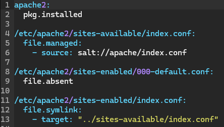

# h4 Demoni

Kaikki tämän dokumentin tehtävät on saatu Tero Karvisen kurssisivulta(Karvinen 2024). Olen merkinnyt dokumenttiin aikoja ainoastaan olennaisiksi kokemiini osioihin. Sisällysluettelo/Viikon 4 tehtävälistaus:

- x)[ Lue ja tiivistä](#x-lue-ja-tiivistä)
- a)[ Hello SLS!](#a-hello-sls)
- b)[ Top.](#b-top)
- c)[ Apache easy mode.](#c-apache-easy-mode)
- d)[ SSHouto](#d-sshouto)
- e)[ Vapaaehtoinen: Apache.](#e-vapaaehtoinen-apache)
- f)[ Vapaaehtoinen: Caddy.](#f-vapaaehtoinen-caddy)
- g)[ Vapaaehtoinen: Nginx.](#g-vapaaehtoinen-nginx)
- [Fyysinen tietokone](#fyysinen-tietokone)
- [Lähdeluettelo](#lähdeluettelo)

---

## Fyysinen tietokone

- Windows 11 Home
  - Versio: 23H2
- Nvidia rtx 2060 näytönohjain
  - 6 GB muistia
- Intel i7-9750H prosessori
  - 6 ydintä
- 2 x 8GB Ram
- 1000 GB NVMe m.2 SSD
  - Josta vapaana +700Gb
- Viimeisimmät päivitykset ja ajurit asennettuna 18.4.2024

---

## x) Lue ja tiivistä

### Karvinen 2023: Salt Vagrant - automatically provision one master and two slaves
Tehtävänä oli lukea ja tiivistää Tero Karvisen artikkelista kaksi kohtaa:  
1. **Infra as Code - Your wishes as a text file**
    - Ensin luodaan tiedostorakennne ja init.sls tiedosto  
    - init.sls on YAML kieltä, jossa sisennyksillä on merkitystä, joten niiden kanssa tulee olla tarkkana ja ne tehdään välilyönnillä(Ei tabilla)  
    - Lopuksi ajetaan tila komennolla `sudo salt '*' state.apply hello` jossa hello on kansion nimi missä init.sls on  
2. **top.sls - What Slave Runs What States** 
    - top.sls määrittelee mitä tiloja ajetaan millekkin orjalle.  
    - top.sls voidaan myös määritellä, mitkä moduulit ajetaan, jolloin niitä ei tarvitse nimetä state.applyn perään  

###### Osion lähteet: (Karvinen 2023)

### Salt contributors: Salt overview
Tehtävänä oli lukea ja tiivistää artikkelin kolme kohtaa: 
1. **Rules of YAML**  
    - YAML kielessä data rakennetaan avain: arvo -pareihin (huomaa välilyönti kaksoispisteen jälkeen)  
    - Avainten arvo voi olla monessa eri rakenteessa  
    - Kaikki avaimet ja ominaisuudet ovat merkkikokoriippuvaisia  
    - YAML käyttää ainoastaan välilyöntiä, ei tabulaattoria sisennyksiin
    - Kommentointi alkaa # -merkillä
2. **YAML simple structure**  
    - YAML koostuu kolmesta perustyypistä: **Scalar**(Skalaari), **Lists**(Lista), **Dictionary**(Sanakirja)  
    - Skalaari sisältää `avain: arvo` -kuvauksen, jossa arvo voi olla numero, merkkijono tai totuusarvo  
    - Lista on `avain:` jota seuraa arvolista, jossa jokainen arvo on omalla rivillä ja jatkuu kahdella välilyönnillä ja yhdysviivalla
    - Sanakirja on kokoelma `avain: arvo` kuvauksia ja listoja
3. **Lists and dictionaries - YAML block structures**  
    - YAML on lohkorakenteisiin järjestetty  
    - Sisennys määrittelee kontekstin, lista ja ominaisuudet **täytyy** sisentää vähintään yhdellä välilyönnillä, mutta standardi on kaksi välilyöntiä
    - Kokoelma joka on lista tai sanakirja sekvenssi, osoittaa jokaisen osion viivan ja välilyönnin avulla: `"- "`    
 ###### Osion lähteet: (VMware S.A.)

### Karvinen 2018: Pkg-File-Service – Control Daemons with Salt – Change SSH Server Port
Tehtävänä oli lukea ja tiivistää artikkeli muutaman ranskalaisen viivan avulla.
- Artikkelin alussa mainitaan, että voin hallita valtavaa määrää demoneita konfiguraationhallintajärjestelmän avulla ja tähän hyvä malli on `Package-file-service` joka korvaa konfiguraatiotiedoston  ja käynnistää demonin uudelleen
- Artikkelissa käydään läpi kuinka Salt-tilan avulla muutetaan SSH-palvelimen porttia  
- Alkutilanne vaatii saltin herra-orja arkkitehtuurin. Masterille tehdään tila (sshd.sls) ja konfiguraatiotiedoston master-kopio(sshd_config)  

1. Ensin luotiin SSH tila  
      
2. Sitten muutettiin sshd_config tiedostoon portin numero ja poistettiin kommentit
3. Ajettiin tila orjalle `sudo salt '*' state.apply sshd`
4. Testattiin tapahtuiko muutokset

###### Osion lähteet: (Karvinen 2018)

### Silmäile Saltin ohjeet tilafunktioille pkg, file ja service.
Koska artikkelit ovat pitkiä, tuli lukea johdanto ja silmillä seuraavia komentoja:

1. **sudo salt-call --local sys.state_doc pkg** *johdanto + pkg.installed, pkg.purged, pkgs* 
    - Komennon johdannossa kerrottiin, että salt voi hallita ohjelmistopaketteja pkg-tilan avulla. Paketit voidaan asettaa asennettaviksi, päivitettäviksi, poistettaviksi tai puhdistettaviksi.
    - pkg.installed varmistaa, että haluttu paketti on asennettu ja käytössä on haluttu versionumero  
    - pkg.purged varmistaa, että haluttu paketti ei ole asennettu ja tarvittaessa poistaa paketin ja siihen liittyvät tiedostot
    - pkgs avulla käyttää useita paketteja samaan aikaan

2. **sudo salt-call --local sys.state_doc file** *johdanto + file.managed, file.absent, file.symlink*
    - Komennon johdannossa kerrottiin, että file komennon avulla voidaan tehdä muutoksia kansioihin ja tiedostoihin
    - file.managed avulla voidaan hallita tiedostoja ja kansioita. Tämän avulla voidaan määritellä useita tiedostoon/kansioon liittyviä asetuksia.   
    - file.absent varmistaa että tietty tiedosto puuttuu ja tarvittaessa se poistaa sen.  
    - file.symlink avulla voidaan luoda symbolinen linkki. Jos tiedosto on olemassa ja symlink osoittaa väärää tiedostoa, symlinkki korvataan.

3. **sudo salt-call --local sys.state_doc service** *johdanto + service.running, service.dead, enable*
    - Komennon avulla voidaan käynnistää ja uudelleenkäynnistää palveluita ja demoneita 
    - service.running varmistaa että haluttu palvelu tai demoni on halutussa tilassa. Jos tila ei ole haluttu, asetetaan se haluttuun tilaan.  
    - service.dead varmistaa että haluttu palvelu on pysäytetty ja jos ei ole, se pysäytetään. 
    - enable varmistaa, että järjestelemän käynnistyessä haluttu palvelu on halutussa tilassa. 

---

## a) Hello SLS!
Tehtävänä oli tehdä Hei maailma -tila kirjoittamalla se init.sls tiedostoon.

1. Aloitin tehtävän kopioimalla Tero Karvisen sivuilta vagrantfilen, jonka avulla saan käyttööni kolme virtuaalikonetta. https://terokarvinen.com/2023/salt-vagrant/ ja asetin kopioidun tiedoston paikallisen koneeni bullseye kansion vagrantfile tiedostoon.
2. Avasin terminaalin ja menin bullseye kansioon jossa kirjoitin `vagrant up` ja odotin noin 5 minuuttia, kun kolme tietokonetta käynnistyi.
3. Otin SSH yhteyden masteriin komennolla `vagrant ssh tmaster`
4. Koska kyseessä oli uusi virtuaalikone, annoin komennot `sudo apt-get update`, `sudo apt-get -y install micro curl salt-master` ja `export EDITOR='micro'`
5. Tein kansion init.sls varten komennolla `sudo mkdir -p /srv/salt/hello` ja tein init.sls tiedoston komennolla `sudoedit /srv/salt/hello/init.sls` jonne kirjoitin:  
    
6. Kirjoitin komennon `cd /srv/salt/hello` ja annoin komennon `sudo salt-call --local state.apply hello`
7. Palautuksena tuli, että `/tmp/heippa-maailma` luotiin, joten tarkistin vielä, että se löytyy  
    

###### Osion lähteet: (Karvinen 2023.)

---

## b) Top.
Tehtävänä oli tehdä top.sls tiedosto, jonka avulla ajetaan useita tiloja automaattisesti. Esim komennot   
> sudo salt '*' state.apply  
> sudo salt-call --local state.apply  
1. Jatkoin siitä, mihin edellisessä osiossa jäätiin, joten aluksi loin uuden kansion `sudo mkdir -p /srv/salt/toinenhello` ja tein sinne tilan komennolla `sudoedit /srv/salt/toinenhello/init.sls`:  
    
2. Tein seuraavaksi top.sls tiedoston `sudoedit /srv/salt/top.sls` jonka sisällöksi tuli:  
    
3. Annoin komennon `sudo salt-call --local state.apply` ja palautuksena tuli, että tehtiin uusi `/tmp/heippa-suomi` ja molempien tilojen ajaminen onnistui.  
    
4. Tarkistin vielä manuaalisesti, että heippa-suomi löytyy  
    

###### Osion lähteet: (Karvinen 2024)

---

## c) Apache easy mode.
Tehtävänä oli asentaa Apache ja korvata sen testisivu ja ajaa asianmukaiset testaukset toiminnasta. Työjärjestykenä käsin asennus, tilan kirjoitut sls-tiedostoon, pkg-file-service
1. Aloitin komennolla `sudo apt-get -y install apache2` ja asennuksen jälkeen annoin komennon `curl localhost` jonka avulla todensin apachen olevan päällä
2. Annoin komennon `echo "TestaajaPRO" | sudo tee /var/www/html/index.html` joka korvaa testisivun sisällön
3. Annoin komennon `sudoedit /etc/apache2/sites-available/index.conf` joka sai sisällöksi:  
    
4. Apachen potkasu ja curlaus komennoilla:  
  - `sudo systemctl restart apache2`  
  - `curl localhost` joka vastasi `TestaajaPRO`

**Nyt olen testannut manuaalisen asennuksen, joten voin automatisoida homman:**
1. Aloitin luomalla uuden kansion `sudo mkdir -p /srv/salt/apache`
2. Tein init.sls tiedoston komennolla `sudoedit /srv/salt/apache/init.sls`  
  
3. Lisäsin polkuun /srv/salt tiedoston `index.html` joka sai sisällöksi `TestaajaPRO2`
4. Tässä kohtaa hyväksyin avaimet kahdesta muusta virtuaalikoneesta komennolla `sudo salt-key -A` ja vastasin `Y`
5. Testasin saanko yhteyden molempiin minioneihin komennolla `sudo salt '*' test.ping`
4. Tässä kohtaa kävin kirjautumassa minionille toisella terminaalilla antaen komennon `vagrant ssh t001` ja asensin sille curlin komennoin `sudo apt-get update` ja `sudo apt-get install curl`
5. `curl localhost` kertoi, ettei ollut mitään curlattavaa, joten annoin masterilla komennon `sudo salt 't001' state.apply apache` ja vastauksena sain succeeded: 3 (changed=2)
6. Menin t001 koneelle ja `curl localhost` joka palautti TestaajaPRO2 kuten kuuluikin.
7. Tein saman vielä t002 koneelle
    - sudo apt-get install curl  
    - `curl localhost` (Palautti: `curl: (7) Failed to connect to localhost port 80: Connection refused`)  
    - masterilla komento `sudo salt 't002' state.apply apache`  
    - t002 koneella `curl localhost` (Palautti: `TestaajaPRO2`)

###### Osion lähteet: (Karvinen 2018, Karvinen 2023, Karvinen 2024)

---

## d) SSHouto
Tehtävänä oli lisätä uusi portti, jossa SSHd kuuntelee.  Poistin osion dokumentoinnin ja aloitin alusta tämän tehtävän kertaalleen, koska ymmärsin tehtävän väärin. Alustin siis myös virtuaalikoneen uudelleen komennoin `vagrant destroy` sekä `vagrant up`

1. Kirjauduin sisään puhtaalle virtuaalikoneelle komennolla `vagrant ssh tmaster`
2. Asensin micron ja asetin sen oletuseditoriksi `sudo apt-get -y install micro` ja `export EDITOR='micro'`
3. Hyväksyin testikoneet komennolla `sudo salt-key -A` ja testasin pingata niihin komennolla `sudo salt '*' test.ping`
4. Otin testikoneiden ip ylös komennolla `sudo salt '*' cmd.run 'hostname -I'`:  
    - t001:  
        - 10.0.2.15 192.168.12.100  
    - t002:  
        - 10.0.2.15 192.168.12.102  

5. Loin kansiorakenteen salttia varten komennolla `sudo mkdir -p /srv/salt/`
6. Loin tiedoston `sshd.sls` komennolla `sudoedit /srv/salt/sshd.sls`  
  
7. Kopioin alkuperäisen sshd_config tiedoston komennolla `sudo cp /etc/ssh/sshd_config /srv/salt/` 

8. Muokkasin kopioitua sshd_config tiedostoa niin, että lisäsin sinne rivit `Port 22` ja `Port 1234` komennolla `sudoedit /srv/salt/sshd_config`

9. Ajoin tilan paikallisesti komennolla `sudo salt-call --local state.apply sshd` ja kaikki onnistui.

11. Lisäsin komennolla `sudoedit /srv/salt/sshd_config` uuden portin 2000 ja ajoin komennon `sudo salt-call --local state.apply sshd` joka kertoi, että portti 2000 lisättiin. 

10. Halusin seurata ssh statusta, joka onnistuu komennolla `sudo systemctl status ssh` ja se oli käynnistynyt uudestaan muutama sekunti sitten, joten voidaan todeta ainakin sen osan toimivan. (restart onnistuu komennolla `sudo systemctl restart ssh`)(Gite 2024)

11. Vielä tulee varmistaa, että pyydetyt portit ovat auki ja se onnistuu komennolla `sudo lsof -i -P -n | grep LISTEN` (NicklasHH)  
  

12. Poistin vielä portit 1234 ja 2000 sekä lisäsin portin 8888 jonka jälkeen ajoin komennon `sudo salt-call --local state.apply sshd` ja `sudo lsof -i -P -n | grep LISTEN`  
  

###### Osion lähteet: (Karvinen 2018, Karvinen 2024, Gite 2024, NicklasHH)

---

## e) Vapaaehtoinen: Apache.
Tehtävänä oli asentaa Apache niin, että weppivu näkyy localhostissa, html:n tulee olla kotihakemistossa ja voidaan muokata ilman sudo oikeuksia.

1. Aloitin siirtymällä terminaalissa oikeaan polkuun, kirjoittamalla `vagrant up` joka loi kaksi tyhjää virtuaalikonetta ja yhdistin toiseen komennolla `vagrant ssh testi1`. Tiedostossa on määritelty asennukset tree, micro ja curl.
2. Aloitin manuaalisella asennuksella  
    >sudo apt-get update  
    >sudo apt-get -y install apache2  
    >export EDITOR='micro  
    >mkdir public_html; cd public_html;micro index.html (index.html sisältää Testisivu)  
    >curl localhost <- Tarkistin että apache päällä  
    >sudoedit /etc/apache2/sites-available/index.conf    
    >  
    >sudo a2ensite index.conf  
    >sudo a2dissite 000-default.conf  
    >sudo systemctl restart apache2  
    >curl localhost <-- Palautti "Testisivu"  

3. Tein Saltille kansion ja sinne kansion Apachea varten komennolla `sudo mkdir -p /srv/salt/apache` jonka jälkeen tein init.sls tiedoston komennolla `sudoedit /srv/salt/apache/init.sls`

4. Kirjoitin init.sls osion vaihe kerrallaan, ensin apachen asennus:  
        

5. Ajoin komennon `sudo salt-call --local state.apply apache` ja huomasin etten ole vielä asentanut salttia, joten asensin sen komennolla `sudo apt-get install salt-master` ja ajoin uudestaan apachen asennus tilan: `sudo salt-call --local state.apply apache`

6. Koska asennus meni läpi, seuraavaksi vuorossa oli lisätä init.sls kansioon File osio:   
        
7. Tein myös apache kansioon kopion alkuperäisestä index.conf tiedostosta komennolla `sudo cp /etc/apache2/sites-available/index.conf /srv/salt/apache` 

8. Ajoin komennon `sudo salt-call --local state.apply apache` ja ei tullut virheitä, joten lisäsin service ja watch osion init.sls tiedostoon:  
        

**Osion pitäisi toimia nyt myös minionilla**
1. Annoin komennon `vagrant ssh testi2` uudella terminaalilla
2. Asensin salt-minionin komennolla `sudo apt-get install salt-minion`
3. Annoin komennon `sudoedit /etc/salt/minion` ja lisäsin ylimmälle riville: `master: 192.168.88.101` ja tämän alapuolelle `id: testi2` jonka jälkeen annoin komennon `sudo systemctl restart salt-minion.service`
4. Masterilla annoin komennon `sudo salt-key -A` ja hyväksyin testi2 koneen.
5. `curl localhost` antoi testi2 koneella 403 forbidden, joten tein sinne kansiot ja index.html tiedoston `mkdir public_html; cd public_html;micro index.html` jonka jälkeen localhostin curlaus palautti index.html sisällön. Seuraavaksi oli siis vuorossa myös noiden tekeminen automaattisesti
6. Masterilla siis lisäsin apache kansioon `index.html` jonka sisälle kirjoitin "testiajoa"

7. Noin 2 tunnin kokeilun ja lukemisen jälkeen sain vihdoin toimimaan tilan niin, että se luo index.html tiedoston public_html kansioon, jos sitä ei ole olemassa. Jos se on olemassa, ei tehdä mitään. Edelleen joudun syöttämään Userin, Groupin ja polun tiedostoon itse ja se oli liian iso pala purtavaksi tässä kohtaa.(VMware 2024)  
  

8. Testasin ensin niin, että public_html kansiota ei ole, ajoin komennon `sudo salt '*' state.apply apache` joka loi public_html kansion jonka sisään index.html tiedoston. Ajoin komennon `curl localhost` joka päivittyi, jonka jälkeen muokkasin index.html tiedostoa ja ajoin `curl localhostin` ja lopuksi ajoin vielä `sudo salt '*' state.apply apache` jonka jälkeen `curl localhost` ei muuttunut vakioetusivuksi.  
  

###### Osion lähteet: (Karvinen 2024, VMware 2024)

---

## f) Vapaaehtoinen: Caddy.
Tehtävänä oli asentaa Caddy niin, että weppivu näkyy localhostissa, html:n tulee olla kotihakemistossa ja voidaan muokata ilman sudo oikeuksia.
1. Alkuun testasin, että `curl localhost` ei vastaa 

###### Osion lähteet: (Karvinen 2024)
---

## g) Vapaaehtoinen: Nginx.
Tehtävänä oli asentaa Nginx niin, että weppivu näkyy localhostissa, html:n tulee olla kotihakemistossa ja voidaan muokata ilman sudo oikeuksia. Tein tehtävää pitkälti seuraamalla löytämiäni ohjeita ja niitä soveltamalla(Andrey 2023).
1. Alkuun tetasin, että `curl localhost` ei vastaa mitään sivustoa.
2. Annoin komennon nginx asennusta varten `sudo apt install nginx`
3. Asennus vei noin minuutin, jonka jälkeen tarkistin, että se oli päällä komennolla `sudo systemctl status nginx`
4. Annoin komennon `sudoedit /etc/nginx/sites-available/default` ja kommentoin rivin 41 root polun pois ja lisäsin sen alle oman polun `root /home/vagrant/public_html;`
5. Annoin komennon `curl localhost` joka palautti `Testisivu` kuten index.html on tarkoitus.
6. Koska tämä toimi, palautin rivin 41 takaisin ja poistin lisäämäni oman hakemiston, jotta voin tehdä oman sites-available tiedoston.
7. Annoin komennon `sudoedit /etc/nginx/sites-available/testisivu`  
  
8. Aktivoin tekemäni tiedoston komennolla `sudo ln -s /etc/nginx/sites-available/testisivu /etc/nginx/sites-enabled/`
9. Käynnistin nginx uudelleen komennolla `sudo systemctl restart nginx` ja annoin komennon `curl localhost` joka palautti jotain apacheen liittyvää, joten siirryin polkuun `/etc/nginx/sites-enabled` jossa poistin default tiedoston komennolla `sudo rm default`
10. Käynnistin nginx uudelleen komennolla `sudo systemctl restart nginx` ja `curl localhost` palautti `Testisivu`, kuten kuului
11. Varmistin vielä toimivuuden muokkaamalla `index.html` sivun sisältöä, jonka jälkeen `curl localhost` palautti muutetun sisällön

###### Osion lähteet: (Andrey 2023, Karvinen 2024)

**Tässä kohtaa manuaalinen asennus oli suoritettu, joten yritin saada toimimaan saltilla**

1. Aloitin homman tekemällä salt kansioon nginx kansion komennolla `sudo mkdir /srv/salt/nginx`
2. Loin `init.sls` kansion komennolla `sudoedit /srv/salt/nginx/init.sls` jonnne ensimmäisenä lisäsin nginx asennuksen  
  

3. Komennolla `sudo salt-call --local state.apply nginx` varmistin, että osio toimii
4. Kopioin testiviun sites-availablesta komennolla `sudo cp /etc/nginx/sites-available/testisivu /srv/salt/nginx`
5. Muokkasin init.sls tiedostoon liittyvät asetukset sekä servicen:  
  

6. Komennolla `sudo salt-call --local state.apply nginx` ajoin tilan, ja kaikki vaikutti olleen hyvin. 

7. Ajoin komennon `sudo salt 'testi2' state.apply nginx` jotta tila ajetaan testi2 koneelle, mutta virheitä tuli paljon:   
  
8. Testi1 koneella kuitenkin ajo onnistuu, joten siirryin testi2 koneelle ja ajoin komennon `sudo systemctl stop apache2` mikä ei vaikuttanut mihinkään.

9. Lueskeltuani virheitä, tulin tarkistaneeksi virtuaalikoneen ajan, ja se näytti edellistä päivää ja muistin lukeneeni edellisen viikon tehtävistä, kuinka se korjataan. Annoin siis komennot `sudo apt-get -y install ntp`, `sudo systemctl enable --now ntp` ja `date` ohjeiden mukaan ja aika oli oikea. (syjaka 2024)

10. Annoin komennon `sudo salt 'testi2' state.apply nginx` ja kaikkien tilojen ajo onnistui.

11. Testasin testi2 koneella `curl localhost` sekä `sudo systemctl status nginx` joten totesin osion toimivan. 

###### Osion lähteet: (Karvinen 2024, Syjaka 2024)

---

## Lähdeluettelo

Gite, V. 2024. Ubuntu Linux: Start, Stop, Restart, Reload OpenSSH Server. Luettavissa: https://www.cyberciti.biz/faq/howto-start-stop-ssh-server/. Luettu: 19.4.2024.

Karvinen, T. 2018. Pkg-File-Service – Control Daemons with Salt – Change SSH Server Port. Luettavissa: https://terokarvinen.com/2018/pkg-file-service-control-daemons-with-salt-change-ssh-server-port/. Luettu: 18.4.2024.

Karvinen, T. 2023. Salt Vagrant - automatically provision one master and two slaves. Luettavissa: https://terokarvinen.com/2023/salt-vagrant/. Luettu: 18.4.2024.

Karvinen, T. 2024. Infra as Code - Palvelinten hallinta 2024. Luettavissa: https://terokarvinen.com/2024/configuration-management-2024-spring/. Luettu: 18.4.2024.

NicklasHH. 2024. Viikon palautus 7. Luettavissa: https://github.com/NicklasHH/Linux-palvelimet/blob/master/h7%20Maalisuora/Palautus7.md. Luettu: 19.4.2024.

VMware S.A. Salt overview. Luettavissa: https://docs.saltproject.io/salt/user-guide/en/latest/topics/overview.html#salt-overview. Luettu: 18.4.2024.

VMware 2024. SALT.STATES.FILE. Luettavissa: https://docs.saltproject.io/en/latest/ref/states/all/salt.states.file.html. Luettu: 19.4.2024.

Andrey, X. 2023. STEP-BY-STEP GUIDE TO INSTALLING NGINX ON DEBIAN 11. Luettavissa: https://friendhosting.net/en/blog/install-nginx-on-debian-11.php. Luettu: 20.4.2024.

Syjaka. 2024. h3 Toimiva versio. Luettavissa: https://github.com/syjaka/Palvelinten-Hallinta-2024/blob/main/h3_Toimiva_versio.md. Luettu: 20.4.2024.