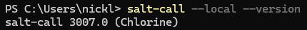
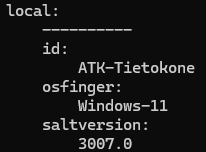

# h5 Tekniikoita

Kaikki tämän dokumentin tehtävät on saatu Tero Karvisen kurssisivulta(Karvinen 2024). Olen merkinnyt dokumenttiin aikoja ainoastaan olennaisiksi kokemiini osioihin. Sisällysluettelo/Viikon 5 tehtävälistaus:

- x)[ Lue ja tiivistä](#x-lue-ja-tiivistä)
- a)[ Asenna Salt Windowsille](#a-asenna-salt-windowsille)
- b)[ Kerää Windows -koneesta tietoa](#b-kerää-windows--konesta-tietoa-grainsitems--toiminnolla)
- c)[ Kerää Windows -koneesta tietoa grains.items -toiminnolla](#c-kokeile-saltin-file--toimintoa-windowsilla)
- d)[ CSI Kerava.](#d-csi-kerava)
- e)[ Komennus](#e-komennus)
- f)[ Vapaaehtoinen: Gui2fs](#f-vapaaehtoinen-gui2fs)
- g)[ Vapaaehtoinen: Ämpärillinen](#g-vapaaehtoinen-ämpärillinen)
- [Fyysinen tietokone](#fyysinen-tietokone)
- [Lähdeluettelo](#lähdeluettelo)

---

## Fyysinen tietokone

- Windows 11 Home
  - Versio: 23H2
- Nvidia rtx 2060 näytönohjain
  - 6 GB muistia
- Intel i7-9750H prosessori
  - 6 ydintä
- 2 x 8GB Ram
- 1000 GB NVMe m.2 SSD
  - Josta vapaana +700Gb
- Viimeisimmät päivitykset ja ajurit asennettuna 27.4.2024
- PowerShell
  - Versio: 7.4.2

---

## x) Lue ja tiivistä

Tehtävänä oli lukea ja tiivistää muutamaan riviin vapaavalintainen aiemman vuoden kotitehtäväraportti Saltin käytöstä Windowsilla. Valitsin raportiksi Tuomas Valkamon raportin [Using salt with Windows](https://tuomasvalkamo.com/CMS-course/week-5/).

- Windowsissa tulee osoittaa hakemisto, mistä salt tilat löydetään
  - `salt-call --file-root=C:\Users\valka\salt --local state.apply hello-windows`
- grains.items tiedot voi suoraan tulostaa tekstitiedostoon komennolla:
  - `salt-call --local grains.items > tech-info.txt`
- Tiedostoon kirjoitettu lopputulos voidaan tulostaa suoraan myös JSON muotoon käyttäen parametriä `--out=json`:
  - `salt-call --local grains.items --out=json > tech-info.txt`

**Oma havainto:** Tiloja tehdessä on hyvä pitää mielessä, että eri käyttöjärjestelmissä on eri komentoja.

###### Osion lähteet: (Valkamo 2022)

---

## a) Asenna Salt Windowsille

Tehtävänä oli asentaa Salt Windowsille ja todentaa sen toiminto. Koska olin asentanut sen jo, tuli vain todentaa toiminta.

1. Avasin PowerShellin Admin tilassa ja kirjoitin komennon `salt-call --local` jonka jälkeen tarkistelin saatavilla olevia komentoja.
2. Ajoin komennon joka kertoo Saltin versionumeron  
   

---

## b) Kerää Windows -koneesta tietoa grains.items -toiminnolla.

Tehtävänä oli kerätä Windows -koneesta tietoja käyttäen grains.items toimintoa, poimia sieltä keskeisiä tietoja sekä analysoida niitä.

1. Annoin PowerShellillä komennon `salt-call --local grains.items` joka toi antoi kaikki saatavilla olevat tiedot.
2. Valitsin listalta näytettäväksi tiedot komennolla `salt-call --local grains.item saltversion id osfinger`.  
    
   - id = Tietokoneen nimi  
   - osfinger = käyttöjärjestelmä  
   - Saltin versionumero  

---

## c) Kokeile Saltin file -toimintoa Windowsilla.

Tehtävänä oli kokeilla Saltin file-toimintoa windowsissa. Käytin tehtävässä apuna ensimmäisen viikon raporttiani.

1. Tein tmp kansion ja polkuna oli `C:\Users\nickl\tmp`

2. Annoin komennon `salt-call --local state.single file.managed C:\Users\nickl\tmp\testitiedosto.txt`.
   - **salt-call** = Käytetään Salttia
   - **--local** = Ajetaan paikallisesti
   - **state.single** = Käytetään yhtä tilaa
   - **file.managed** = Määrittelee käytettävän tilan
   - **C:\Users\nickl\tmp\testitiedosto.txt** = Polku jota hallinnoidaan

3. Tarkistin `tmp` kansiossa ollessani komennolla `ls`, että `testitiedosto.txt` löytyi
4. Poistin tiedoston antamalla komennon `salt-call --local state.single file.absent C:\Users\nickl\tmp\testitiedosto.txt` 
5. Tarkistin `ls` komennolla, että tiedosto oli kadonnut

###### Osion lähteet: (NicklasHH 2024)

---

## d) CSI Kerava.

Tehtävänä oli näyttää `find` komennon avulla viimeisimmäksi muokatut tiedostot `/etc/` -hakemistosta kotihakemistosta. Kaikki käytetyt parametrit ja format string tulee selittää `man find` lähteenä käyttäen.

1. abc

###### Osion lähteet: ()

---

## e) Komennus

Tehtävänä oli tehdä Salt-tila, joka asentaa järjestelmään uuden komennon.

1. abc

###### Osion lähteet: ()

---

## f) Vapaaehtoinen: Gui2fs.

Tehtävänä oli muokata asetuksia jostain graafisen käyttöliittymän ohjelmasta käyttäen ohjelman omia valikoita/dialogeja sekä etsiä tämä asetus tiedostojärjestelmästä.

1. abc

###### Osion lähteet: ()

---

## g) Vapaaehtoinen: Ämpärillinen.

Tehtävänä oli tehdä Salt-tila, joka asentaa järjestelmään kansiollisen komentoja. Tila tuli tehdä recurse(tms) parametriä hyödyntäen niin, että en joudu luettelemaan jokaista asennettavaa komentoa ja skipritä erikseen sls-tiedostossa.

1. abc

###### Osion lähteet: ()

---

## Lähdeluettelo

Karvinen, T. 2024. Infra as Code - Palvelinten hallinta 2024. Luettavissa: https://terokarvinen.com/2024/configuration-management-2024-spring/. Luettu: 27.4.2024.

Valkamo, T. 2022. Using Salt with Windows. Luettavissa: https://tuomasvalkamo.com/CMS-course/week-5/. Luettu: 27.4.2024.

NicklasHH. 2024. h1 Viisikko. Luettavissa: https://github.com/NicklasHH/Palvelinten-hallinta/blob/master/h1%20Viisikko/h1%20Viisikko.md. Luettu: 27.4.2024.