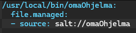
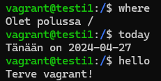

# h5 Tekniikoita

Kaikki tämän dokumentin tehtävät on saatu Tero Karvisen kurssisivulta(Karvinen 2024). Olen merkinnyt dokumenttiin aikoja ainoastaan olennaisiksi kokemiini osioihin. Sisällysluettelo/Viikon 5 tehtävälistaus:

- x)[ Lue ja tiivistä](#x-lue-ja-tiivistä)
- a)[ Asenna Salt Windowsille](#a-asenna-salt-windowsille)
- b)[ Kerää Windows -koneesta tietoa](#b-kerää-windows--konesta-tietoa-grainsitems--toiminnolla)
- c)[ Kerää Windows -koneesta tietoa grains.items -toiminnolla](#c-kokeile-saltin-file--toimintoa-windowsilla)
- d)[ CSI Kerava.](#d-csi-kerava)
- e)[ Komennus](#e-komennus)
- f)[ Vapaaehtoinen: Gui2fs](#f-vapaaehtoinen-gui2fs)
- g)[ Vapaaehtoinen: Ämpärillinen](#g-vapaaehtoinen-ämpärillinen)
- [Fyysinen tietokone](#fyysinen-tietokone)
- [Lähdeluettelo](#lähdeluettelo)

---

## Fyysinen tietokone

- Windows 11 Home
  - Versio: 23H2
- Nvidia rtx 2060 näytönohjain
  - 6 GB muistia
- Intel i7-9750H prosessori
  - 6 ydintä
- 2 x 8GB Ram
- 1000 GB NVMe m.2 SSD
  - Josta vapaana +700Gb
- Viimeisimmät päivitykset ja ajurit asennettuna 27.4.2024
- PowerShell
  - Versio: 7.4.2

---

## x) Lue ja tiivistä

Tehtävänä oli lukea ja tiivistää muutamaan riviin vapaavalintainen aiemman vuoden kotitehtäväraportti Saltin käytöstä Windowsilla. Valitsin raportiksi Tuomas Valkamon raportin [Using salt with Windows](https://tuomasvalkamo.com/CMS-course/week-5/).

- Windowsissa tulee osoittaa hakemisto, mistä salt tilat löydetään
  - `salt-call --file-root=C:\Users\valka\salt --local state.apply hello-windows`
- grains.items tiedot voi suoraan tulostaa tekstitiedostoon komennolla:
  - `salt-call --local grains.items > tech-info.txt`
- Tiedostoon kirjoitettu lopputulos voidaan tulostaa suoraan myös JSON muotoon käyttäen parametriä `--out=json`:
  - `salt-call --local grains.items --out=json > tech-info.txt`

**Oma havainto:** Tiloja tehdessä on hyvä pitää mielessä, että eri käyttöjärjestelmissä on eri komentoja.

###### Osion lähteet: (Valkamo 2022)

---

## a) Asenna Salt Windowsille

Tehtävänä oli asentaa Salt Windowsille ja todentaa sen toiminto. Koska olin asentanut sen jo, tuli vain todentaa toiminta (Karvinen 2024).

1. Avasin PowerShellin Admin tilassa ja kirjoitin komennon `salt-call --local` jonka jälkeen tarkistelin saatavilla olevia komentoja.
2. Ajoin komennon joka kertoo Saltin versionumeron  
   

---

## b) Kerää Windows -koneesta tietoa grains.items -toiminnolla.

Tehtävänä oli kerätä Windows -koneesta tietoja käyttäen grains.items toimintoa, poimia sieltä keskeisiä tietoja sekä analysoida niitä (Karvinen 2024).

1. Annoin PowerShellillä komennon `salt-call --local grains.items` joka toi antoi kaikki saatavilla olevat tiedot.
2. Valitsin listalta näytettäväksi tiedot komennolla `salt-call --local grains.item saltversion id osfinger`.  
    
   - id = Tietokoneen nimi  
   - osfinger = käyttöjärjestelmä  
   - Saltin versionumero  

---

## c) Kokeile Saltin file -toimintoa Windowsilla.

Tehtävänä oli kokeilla Saltin file-toimintoa windowsissa. Käytin tehtävässä apuna ensimmäisen viikon raporttiani (Karvinen 2024).

1. Tein tmp kansion ja polkuna oli `C:\Users\nickl\tmp`

2. Annoin komennon `salt-call --local state.single file.managed C:\Users\nickl\tmp\testitiedosto.txt`.
   - **salt-call** = Käytetään Salttia
   - **--local** = Ajetaan paikallisesti
   - **state.single** = Käytetään yhtä tilaa
   - **file.managed** = Määrittelee käytettävän tilan
   - **C:\Users\nickl\tmp\testitiedosto.txt** = Polku jota hallinnoidaan

3. Tarkistin `tmp` kansiossa ollessani komennolla `ls`, että `testitiedosto.txt` löytyi
4. Poistin tiedoston antamalla komennon `salt-call --local state.single file.absent C:\Users\nickl\tmp\testitiedosto.txt` 
5. Tarkistin `ls` komennolla, että tiedosto oli kadonnut

###### Osion lähteet: (NicklasHH 2024a)

---

## d) CSI Kerava.

Tehtävänä oli näyttää `find` komennon avulla viimeisimmäksi muokatut tiedostot `/etc/` -hakemistosta kotihakemistosta. Kaikki käytetyt parametrit ja format string tulee selittää `man find` lähteenä käyttäen (Karvinen 2024).
Alkutoimena siirryin kansioon `C:\Users\nickl\vagrantduo` koska tiesin siellä olevan jonkun vanhan virtuaalikoneen. Annoin komennon `cat vagrantfile` ja tarkistin minkä nimisiä koneita asetustiedostossa tehtiin ja annoin komennon `vagrant up testi1` käynnistääkseni vain yhden virtuaalikoneen. Lopuksi yhdistin virtuaalikoneeseen komennolla `vagrant ssh testi1`

1. Käytin komentoa `man find` ja tutkin mitä kaikkea voidaan käyttää find toiminnossa. Tein lisäksi uuden kansion kotihakemistoon, jotta pystyin todentamaan find komennon toimivuuden. Pohjana oli Tero Karvisen tunnilla käyttämä komento, jonka löysin tuntimuistiinpanoistani `find -printf '%T+ %p\n' | sort` ja lähdin tämän pohjalta rakentamaan komentoa. Manuaalista kiinnostuneille on siitä olemassa myös [online versio](https://man7.org/linux/man-pages/man1/find.1.html).

2. Testailun jälkeen päätin käyttää komentoa `sudo find /etc $HOME -printf '%T+ %p\n' | sort -n | tail -10`  
   
   - **find** = Komento hakua varten
   - **/etc $HOME** = Hakupaikkojen määritys, tässä käytössä /etc kansio sekä kotihakemisto
   - **-printf '%T+ %p\n'** = Tulostus, jossa määritellään formaatti joka on tässä muokkauspäivämäärä(%T+), polku(%p) ja uusi rivi (\n)
   - **sort -n** = Newer, eli järjestetään viimeksi muokatun mukaan
   - **tail -10** = Näytetään kymmenen viimeisintä
 3. Huomasin tuloksia tutkiessa, että aikaleimat ovat kaikki tältä päivältä, joten lisäsin sort komennon perään `-r` joka kääntää hakutuloksen niin, että vanhimmat näkyy ensin, jolloin myös päivämäärät muuttuivat:  
   

###### Osion lähteet: Linuxin terminaalissa komento `man find` sekä omat tuntimuistiinpanot

---

## e) Komennus

Tehtävänä oli tehdä Salt-tila, joka asentaa järjestelmään uuden komennon. Käytin osiossa hyödyksi Linux-palvelimet kurssin viikon 7 raporttiani ja Tero Karvisen kurssisivun ohjeistusta(NicklasHH 2024b, Karvinen 2024)

1. Kirjauduin jo edellisessä osiossa käytettyyn testi1 virtuaalikoneeseen komennolla `vagrant ssh testi1`
2. Tein tiedoston komentoa varten komennolla `micro omaOhjelma`. Sisällöksi kirjoitin scriptin, joka asettaa muuttujaan `user` käyttäjän nimen ja tervehtii sitä.  
  
3. Lisäsin suoritusoikeudet komennolla `chmod ugo+x omaOhjelma` kaikille käyttäjille (user, group ja others)
4. Testasin scriptiä ajamalla sen komennolla `./omaOhjelma`  
  
5. Kopioin omaOhjelma tiedoston oikeaan paikkaan komennolla `sudo cp omaOhjelma /usr/local/bin/`
6. Varmistin toiminnan vaihtamalla polkua ja annoin pelkän komennon ohjelman ajamiseen  
  
7. Tein uuden käyttän komennolla `sudo adduser testaajapro` ja kirjauduin sille komennolla `su testaajapro` ja ajoin tekemäni ohjelman komennolla `omaOhjelma`  
  

**Ohjelman tekeminen onnistui, joten siirryn Salt-tilan tekoon**
1. Koska käytössä oli vanha virtuaalikone, löytyi täältä jo valmiiksi saltin kansio. Tein uutta tilaa varten uuden kansion komennolla `mkdir ohjelma`  
  
2. Ollessani salt kansiossa, annoin komennon `sudo cp /usr/local/bin/omaOhjelma ohjelma` joka kopioi tekemäni ohjelman saltin ohjelma kansioon.  
  
3. Tein init.sls tiedoston komennolla `micro init.sls` ja testasin seuraavaa: Asetin polun minne tiedosto lisätään, file.managed kertoo mitä tehdään ja source kertoo mistä lisättävä tiedosto löytyy.  
  
4. Käynnistin toisen virtuaalikoneen komennolla `vagrant up testi2` ja yhdistin siihen komennolla `vagrant ssh testi2`
5. Annoin testi2 koneella komennon `omaOhjelma` ja palautuksena tuli `-bash: omaOhjelma: command not found` eli komentoa ei vielä ole
6. Ajoin testi1 koneella tilan testi2 koneelle komennolla `sudo salt 'testi2' state.apply ohjelma` mutta tilan ajaminen ei onnistunut  
  
7. Lisäsin 2 välilyöntiä riville 3 mutta samat virheet jatkuivat edelleen.  
  
8. Huomasin polun olevan virheellinen source osiossa, joten korjasin myös sen  
  
9. Ajoin uudelleen komennon `sudo salt 'testi2' state.apply ohjelma` ja nyt tilan ajaminenn onnistui  
  
10. Ajoin komennon `omaOhjelma` testi2 koneella. Palautuksena komentoon tuli `-bash: /usr/local/bin/omaOhjelma: Permission denied` ja uskoin tietäväni jo, että vika on siinä, ettei Saltin tilassa määritelty käyttöoikeuksia mutta tarkistin vielä antamalla komennon `ls -l /usr/local/bin/omaOhjelma` ja siellä tosiaan oli ainoastaan lukuoikeudet.

11. Tiesin, että init.sls tiedostossa tulee antaa suoritusoikeus, joten sain saltin dokumentaatiosta selville, että se tulee antaa `mode:` osiossa(WMware 2024). Muokkasin init.sls tiedostoa niin, että lisäsin osion `- mode: 755` joka antaa luku ja suoritusoikeuden kaikille.  
  
12. Ajoin saltin tilan testi2 koneelle ja annoin testi2 koneella komennon `omaOhjelma`  
  
13. Toimivuuden varmistamisen jälkeen ajoin vielä uudelleen Salt-tilan ja mitään muutoksia ei tehty, joten osio on valmis.

###### Osion lähteet: (WMware 2024, NicklasHH 2024b, Karvinen 2024)

---

## f) Vapaaehtoinen: Gui2fs.

Tehtävänä oli muokata asetuksia jostain graafisen käyttöliittymän ohjelmasta käyttäen ohjelman omia valikoita/dialogeja sekä etsiä tämä asetus tiedostojärjestelmästä. Asensin tehtävää varten tyhjän Debian 12 virtuaalikoneen ja siihen micro editorin.

1. Asensin komennolla `sudo apt-get install vlc` VLC media playerin
2. Muuttelin erinäisiä asetuksia `Preferences` napin takaa
3. Annoin komennon `sudo find -printf '%T+ %p\n' | sort -n | grep vlc` joka näytti, että muutokset tallennetaan `./.config/vlc/vlc-qt-interface.conf`
4. Tarkistin vielä sisällön menemällä kyseiseen polkuun ja tarkastelin sisältöä microlla    
     
    

---

## g) Vapaaehtoinen: Ämpärillinen.

Tehtävänä oli tehdä Salt-tila, joka asentaa järjestelmään kansiollisen komentoja. Tila tuli tehdä recurse(tms) parametriä hyödyntäen niin, että en joudu luettelemaan jokaista asennettavaa komentoa ja skipritä erikseen sls-tiedostossa.

1. Aloitin osion kirjautumalla testi1 virtuaalikoneelle ja tein uuden kansion `ampari`  
    

2. Tein polkuun `/home/vagrant/testikansio` tiedoston `testi` jolle annoin vapaammat suoritusoikeudet komennolla `chmod ugo+x testi` ja testasin ohjelman komennolla `./testi` Tämän avulla saan testattua tässä helposti tekemäni komennot jonka jälkeen voin kopioida ne omiin osioihinsa. Tein myös valmiiksi tässä kohtaa ampari kansion polkuun `/home/vagrant/ampari`.  
  

3. **Komento 1**  
  

4. **Komento 2**  
  

5. **Komento 3**  
  

6. Annoin komentojen teon jälkeen koko kansiolle suoritusoikeuden komennolla `sudo chmod +x ampari/*` ja kopioin ampari kansion polkuun `/usr/local/bin/` komennolla `sudo cp -r ampari /usr/local/bin/`. Tämän jälkeen ei komennot kuitenkaan toiminut, joten siirsin pelkät tiedostot komennolla `sudo cp ampari/* /usr/local/bin/` jonka jälkeen komennot toimivat.  
  

7. Kopioin alkuperäisen ampari tiedoston komennolla `sudo cp -r ampari /srv/salt/ampari/` ja tarkistin, että koko tiedosto ampari siirtyi. 
  

8. Tein init.sls tiedoston komennolla `micro init.sls` ampari kansioon saltin oman dokumentaation avulla jossa käsiteltiin recursea(WMware 2024).  
  
9. Sain salt-tilaa ajettaessa virheen `Comment: 'mode' is not allowed in 'file.recurse'. Please use 'file_mode' and 'dir_mode'.` joten vaihdoin mode osion file_mode  
  

10. Korjauksien jälkeen tilan ajaminen onnistui joten ajoin sen testi2 koneelle komennolla `sudo salt 'testi2' state.apply ampari` joka näytti menevän läpi  
  

11. Tila ajettu onnistuneesti ja testaus näytti kaiken toimivan kuten pitää.  
  

###### Osion lähteet: (Karvinen 2024, WMware 2024)

---

## Lähdeluettelo

Karvinen, T. 2024. Infra as Code - Palvelinten hallinta 2024. Luettavissa: https://terokarvinen.com/2024/configuration-management-2024-spring/. Luettu: 27.4.2024.

NicklasHH 2024a. h1 Viisikko. Luettavissa: https://github.com/NicklasHH/Palvelinten-hallinta/blob/master/h1%20Viisikko/h1%20Viisikko.md. Luettu: 27.4.2024.

NicklasHH 2024b. Viikon palautus 7. Luettavissa: https://github.com/NicklasHH/Linux-palvelimet/blob/master/h7%20Maalisuora/Palautus7.md. Luettu: 27.4.2024.

Valkamo, T. 2022. Using Salt with Windows. Luettavissa: https://tuomasvalkamo.com/CMS-course/week-5/. Luettu: 27.4.2024.

WMware 2024. SALT.STATES.FILE. Luettavissa: https://docs.saltproject.io/en/latest/ref/states/all/salt.states.file.html. Luettu: 27.4.2024.