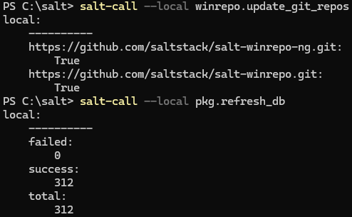
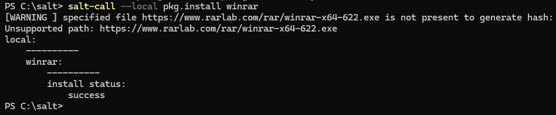
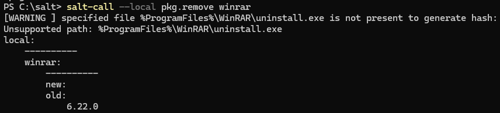

# h6 Benchmark

Kaikki tämän dokumentin tehtävät on saatu Tero Karvisen kurssisivulta(Karvinen 2024). Olen merkinnyt dokumenttiin aikoja ainoastaan olennaisiksi kokemiini osioihin. Sisällysluettelo/Viikon tehtävälistaus:

- x)[ Lue ja tiivistä](#x-lue-ja-tiivistä)
- a)[ Paketti Windowsia](#a-paketti-windowsia)
- b)[ Benchmark](#b-benchmark)
- c)[ Testbench](#c-testbench)
- d)[ Viisi ideaa](#d-viisi-ideaa)
- [Fyysinen tietokone](#fyysinen-tietokone)
- [Lähdeluettelo](#lähdeluettelo)

---

## Fyysinen tietokone

- Windows 11 Home
  - Versio: 23H2
- Nvidia rtx 2060 näytönohjain
  - 6 GB muistia
- Intel i7-9750H prosessori
  - 6 ydintä
- 2 x 8GB Ram
- 1000 GB NVMe m.2 SSD
  - Josta vapaana +700Gb
- Viimeisimmät päivitykset ja ajurit asennettuna 1.5.2024
- PowerShell
  - Versio: 7.4.2

---

## x) Lue ja tiivistä

Tehtävänä oli lukea ja tiivistää muutaman ranskalaisen viivan avulla annetusta artikkelista (WMvare 2024) osiot: Introduction, Install libraries, Populate the local Git repository, Update minion database, Install software package, Usage.

- [Introduction](https://docs.saltproject.io/en/latest/topics/windows/windows-package-manager.html#introduction)
  - Windows Salt -paketinhallinta tarvitsee .sls tiedostoon: Ohjelman täydellisen nimen, Version, latauspaikan  
  - Githubin repositorio [salt-winrepo-ng](https://github.com/saltstack/salt-winrepo-ng) pitää sisällään useita pakettimäärittelytiedostoja yleisimmille windows-paketeille.  
  - Ohjelmistopaketteja voidaan ladata joko git-arkistosta, HTTP(s)- tai FTP-URL osoitteista.  

- [Install libraries](https://docs.saltproject.io/en/latest/topics/windows/windows-package-manager.html#install-libraries)
  - Jos käytössä on Windows -pakettienhallinta, jossa pakettimääritelmätiedostot ovat sijoitettu Salt Git repoon, tulee asentaa kirjasto GitPython tai pygit2  

- [Populate the local Git repository](https://docs.saltproject.io/en/latest/topics/windows/windows-package-manager.html#populate-the-local-git-repository)
  - Oletusarvoisesti windowsin pakettienhallintaan käytettyä .sls tiedostoa ei jaeta Saltin kanssa. Se tulee alustaa ja kloonata  [salt-winrepo-ng](https://github.com/saltstack/salt-winrepo-ng) repositoriosta. `salt-run winrepo.update_git_repos`  
  - Repository kloonaantuu kansioon `winrepo_dir_ng`  

- [Update minion database](https://docs.saltproject.io/en/latest/topics/windows/windows-package-manager.html#update-minion-database)
  - `pkg.refresh_db` tulee suorittaa jokaisella minionilla. Komento luo tietokantaan merkinnän jokaisesta paketinmäärittely tiedostosta ja kokoaa tietokannan  
  - Windowsin pakettien määrittelyn yhteydessä voidaan tarkistaa myös määritysten virheet komennolla `pkg.refresh_db`  

- [Install software package](https://docs.saltproject.io/en/latest/topics/windows/windows-package-manager.html#install-software-package)
  - Paketinhallinnan määrittelytiedoston jälkeen tulisi pystyä lataamaan paketteja  
  - Esimerkki komento masterilla ajettuna olisi `salt * pkg.install 'firefox_x64'` joka asentaa firefoxin  

- [Usage](https://docs.saltproject.io/en/latest/topics/windows/windows-package-manager.html#usage)
  - `pkg.list_pkgs` listaa kaikki asennetut paketit  
    - Ohjelman nimi kertoo hallinnoidaanko sitä saltilla vai ei  
  - `pkg.list_available` Näyttää tietyn paketin saatavilla olevat versiot  
  - `pkg.install` Asentaa annetun paketin  
    - `salt winminion pkg.install 'firefox_x64'` asentaa firefoxin  
    - `salt winminion pkg.install 'firefox_x64' version=74.0` asentaa tietyn firefox version  
    - Jos asennuksesta löytyy toinen versio, korvataan se halutulla versiolla
  - `pkg.remove` Poistaa annetun paketin  
    - Kaikki pakettien määritystiedostot tallennetaan sijaintiin joka määritetään `winrepo_dir_ng` asetuksissa  
    - `salt-winrepo-ng` kansion tiedostoja ei saa muokata tai `winrepo.update_git_repos` ei enää toimi  
    - Usage osiosta löytyi tarkka [ohje](https://docs.saltproject.io/en/latest/topics/windows/windows-package-manager.html#writing-package-definition-files) pakettien määrittelyn kirjoittamiselle  

###### Osion lähteet: (WMvare 2024)

---

## a) Paketti Windowsia

Tehtävänä oli asentaa Windowsiin ohjelmia Saltin pkg.installed -funktiolla ja raportoida työvaiheet. Asennuksen ohjeena käytin aiemmin lukemaani artikkelia (WMware 2024).

1. Avasin Powershellin adminina. Menin polkuun `C:\salt` ja annoin komennon `salt-call --local winrepo.update_git_repos` jonka jälkeen annoin komennon `salt-call --local pkg.refresh_db`  
    
2. Siirryin katsomaan asennettavaa sisältöä [salt-winrepo-ng](https://github.com/saltstack/salt-winrepo-ng)  
3. Päädyin kokeilemaan winrarin asennusta. Olen joskus aikaisemmin käyttänyt sovellusta, joten valitsin sen vain nimen perusteella. Annoin siis komennon `salt-call --local pkg.install winrar`  
4. Komennon suorituksen yhteydessä tuli varoitus, mutta install statuksena oli kuitenkin succes. Winrar löytyi windowsin hakutoiminnolla ja käynnistyi joten asennus on suoritettu.  
    
5. Kokeilin lopuksi vielä poistamista komennolla `salt-call --local pkg.remove winrar` jonka jälkeen winraria ei enään löytynyt windowsin hakutoiminnolla  
  

**Huomiona** se, että tehtävänannossa puhuttiin pkg.installed funktiosta. Asennukset tein `pkg.install` funktiolla ja WMwaren artikkelista saamani ymmärryksen mukaan `pkg.installed` toimii minioniin ja `pkg.install` toimii paikalliseen asennukseen  

###### Osion lähteet: (WMWare 2024)

---

## b) Benchmark

Tehtävänä oli etsiä 3-7 keskitetyn hallinnan projektia aikaisempien Palvelinten hallinta kurssien lopputöistä. Töissä tuli olla käytössä modernia keskitettyä hallintaa. Työt tuli arvioida sivuton perusteella, eli niitä ei itse testata. Jokaisesta lopputyöstä tuli listata:

- Tarkoitus
  - Mitä hyötyä tästä on
  - Miksi halusin asentaa tämän
- Lisenssi
  - Lisenssin nimi
  - Mistä lisenssi käy ilmi
  - Mitä kyseinen lisenssi tarkoittaa
- Tekijä ja vuosi
- Riippuvuudet
  - Käyttöjärjestelmä
  - Verkkoympäristö
- Kiinnostavaa esim
  - kiinnostava tekniikka
  - hyödyllinen lopputulos
- Avoimet kysymykset ja huomiot

1. abc (lähdeviite)
2. abc (lähdeviite)
3. abc (lähdeviite)
4. abc (lähdeviite)

###### Osion lähteet: ()

---

## c) Testbench

Tehtävänä oli valita perustelujen kanssa yksi edellisen osion töistä. Valitusta tehtävästä tuli tarkistaa koodi(Lataako koodi binäärejä, oliko ohjelmistolähteet luotettavia, ladattiinko jotain paketinhallinnan ulkopuolelta), jonka jälkeen koodi tuli ajaa ja testata lopputulos. Tarkoituksena oli kommentoida, arvioida ja ajaa modulia, joten mahdolliset bugit tuli raportoida.

###### Osion lähteet: ()

---

## d) Viisi ideaa

Tehtävänä oli listata viisi omaa ideaa modulille kurssin lopputehtävää varten. Moduleilla tuli olla jokin tarkoitus ja jokaista tuli kuvata vähintään yhdellä virkkeellä.

1.
2.
3.
4.
5.

---

## Lähdeluettelo

Karvinen, T. 2024. Infra as Code - Palvelinten hallinta 2024. Luettavissa: https://terokarvinen.com/2024/configuration-management-2024-spring/. Luettu: 3.5.2024.

VMware 2024. WINDOWS PACKAGE MANAGER. Luettavissa: https://docs.saltproject.io/en/latest/topics/windows/windows-package-manager.html. Luettu: 3.5.2024.
