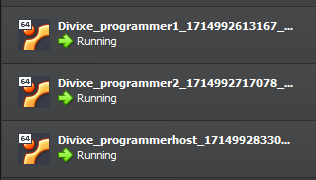

# h6 Benchmark

Kaikki tämän dokumentin tehtävät on saatu Tero Karvisen kurssisivulta(Karvinen 2024). Olen merkinnyt dokumenttiin aikoja ainoastaan olennaisiksi kokemiini osioihin. Sisällysluettelo/Viikon tehtävälistaus:

- x)[ Lue ja tiivistä](#x-lue-ja-tiivistä)
- a)[ Paketti Windowsia](#a-paketti-windowsia)
- b)[ Benchmark](#b-benchmark)
- c)[ Testbench](#c-testbench)
- d)[ Viisi ideaa](#d-viisi-ideaa)
- [Fyysinen tietokone](#fyysinen-tietokone)
- [Lähdeluettelo](#lähdeluettelo)

---

## Fyysinen tietokone

- Windows 11 Home
  - Versio: 23H2
- Nvidia rtx 2060 näytönohjain
  - 6 GB muistia
- Intel i7-9750H prosessori
  - 6 ydintä
- 2 x 8GB Ram
- 1000 GB NVMe m.2 SSD
  - Josta vapaana +700Gb
- Viimeisimmät päivitykset ja ajurit asennettuna 1.5.2024
- PowerShell
  - Versio: 7.4.2

---

## x) Lue ja tiivistä

Tehtävänä oli lukea ja tiivistää muutaman ranskalaisen viivan avulla annetusta artikkelista (WMvare 2024) osiot: Introduction, Install libraries, Populate the local Git repository, Update minion database, Install software package, Usage.

- [Introduction](https://docs.saltproject.io/en/latest/topics/windows/windows-package-manager.html#introduction)
  - Windows Salt -paketinhallinta tarvitsee .sls tiedostoon: Ohjelman täydellisen nimen, Version, latauspaikan  
  - Githubin repositorio [salt-winrepo-ng](https://github.com/saltstack/salt-winrepo-ng) pitää sisällään useita pakettimäärittelytiedostoja yleisimmille windows-paketeille.  
  - Ohjelmistopaketteja voidaan ladata joko git-arkistosta, HTTP(s)- tai FTP-URL osoitteista.  

- [Install libraries](https://docs.saltproject.io/en/latest/topics/windows/windows-package-manager.html#install-libraries)
  - Jos käytössä on Windows -pakettienhallinta, jossa pakettimääritelmätiedostot ovat sijoitettu Salt Git repoon, tulee asentaa kirjasto GitPython tai pygit2  

- [Populate the local Git repository](https://docs.saltproject.io/en/latest/topics/windows/windows-package-manager.html#populate-the-local-git-repository)
  - Oletusarvoisesti windowsin pakettienhallintaan käytettyä .sls tiedostoa ei jaeta Saltin kanssa. Se tulee alustaa ja kloonata  [salt-winrepo-ng](https://github.com/saltstack/salt-winrepo-ng) repositoriosta. `salt-run winrepo.update_git_repos`  
  - Repository kloonaantuu kansioon `winrepo_dir_ng`  

- [Update minion database](https://docs.saltproject.io/en/latest/topics/windows/windows-package-manager.html#update-minion-database)
  - `pkg.refresh_db` tulee suorittaa jokaisella minionilla. Komento luo tietokantaan merkinnän jokaisesta paketinmäärittely tiedostosta ja kokoaa tietokannan  
  - Windowsin pakettien määrittelyn yhteydessä voidaan tarkistaa myös määritysten virheet komennolla `pkg.refresh_db`  

- [Install software package](https://docs.saltproject.io/en/latest/topics/windows/windows-package-manager.html#install-software-package)
  - Paketinhallinnan määrittelytiedoston jälkeen tulisi pystyä lataamaan paketteja  
  - Esimerkki komento masterilla ajettuna olisi `salt * pkg.install 'firefox_x64'` joka asentaa firefoxin  

- [Usage](https://docs.saltproject.io/en/latest/topics/windows/windows-package-manager.html#usage)
  - `pkg.list_pkgs` listaa kaikki asennetut paketit  
    - Ohjelman nimi kertoo hallinnoidaanko sitä saltilla vai ei  
  - `pkg.list_available` Näyttää tietyn paketin saatavilla olevat versiot  
  - `pkg.install` Asentaa annetun paketin  
    - `salt winminion pkg.install 'firefox_x64'` asentaa firefoxin  
    - `salt winminion pkg.install 'firefox_x64' version=74.0` asentaa tietyn firefox version  
    - Jos asennuksesta löytyy toinen versio, korvataan se halutulla versiolla
  - `pkg.remove` Poistaa annetun paketin  
    - Kaikki pakettien määritystiedostot tallennetaan sijaintiin joka määritetään `winrepo_dir_ng` asetuksissa  
    - `salt-winrepo-ng` kansion tiedostoja ei saa muokata tai `winrepo.update_git_repos` ei enää toimi  
    - Usage osiosta löytyi tarkka [ohje](https://docs.saltproject.io/en/latest/topics/windows/windows-package-manager.html#writing-package-definition-files) pakettien määrittelyn kirjoittamiselle  

###### Osion lähteet: (WMvare 2024)

---

## a) Paketti Windowsia

Tehtävänä oli asentaa Windowsiin ohjelmia Saltin pkg.installed -funktiolla ja raportoida työvaiheet. Asennuksen ohjeena käytin aiemmin lukemaani artikkelia (WMware 2024).

1. Avasin Powershellin adminina. Menin polkuun `C:\salt` ja annoin komennon `salt-call --local winrepo.update_git_repos` jonka jälkeen annoin komennon `salt-call --local pkg.refresh_db`  
    
2. Siirryin katsomaan asennettavaa sisältöä [salt-winrepo-ng](https://github.com/saltstack/salt-winrepo-ng)  
3. Päädyin kokeilemaan winrarin asennusta. Olen joskus aikaisemmin käyttänyt sovellusta, joten valitsin sen vain nimen perusteella. Annoin siis komennon `salt-call --local pkg.install winrar`  
4. Komennon suorituksen yhteydessä tuli varoitus, mutta install statuksena oli kuitenkin succes. Winrar löytyi windowsin hakutoiminnolla ja käynnistyi joten asennus on suoritettu.  
    
5. Kokeilin lopuksi vielä poistamista komennolla `salt-call --local pkg.remove winrar` jonka jälkeen winraria ei enään löytynyt windowsin hakutoiminnolla  
  

**Huomiona** se, että tehtävänannossa puhuttiin pkg.installed funktiosta. Asennukset tein `pkg.install` funktiolla ja WMwaren artikkelista saamani ymmärryksen mukaan `pkg.installed` toimii minioniin ja `pkg.install` toimii paikalliseen asennukseen  

###### Osion lähteet: (WMWare 2024)

---

## b) Benchmark

Tehtävänä oli etsiä 3-7 keskitetyn hallinnan projektia aikaisempien Palvelinten hallinta kurssien lopputöistä. Töissä tuli olla käytössä modernia keskitettyä hallintaa. Työt tuli arvioida sivuton perusteella, eli niitä ei itse testata. Jokaisesta lopputyöstä tuli listata:

- Tarkoitus
  - Mitä hyötyä tästä on
  - Miksi halusin asentaa tämän
- Lisenssi
  - Lisenssin nimi
  - Mistä lisenssi käy ilmi
  - Mitä kyseinen lisenssi tarkoittaa
- Tekijä ja vuosi
- Riippuvuudet
  - Käyttöjärjestelmä
  - Verkkoympäristö
- Kiinnostavaa esim
  - kiinnostava tekniikka
  - hyödyllinen lopputulos
- Avoimet kysymykset ja huomiot

##### h7 - Miniproject (ojarv 2023)
   - Tarkoitus: Projektin tarkoituksena oli asentaa ja mukauttaa Windows 11 käyttäjärjestelmää Saltia hyödyntäen
   - Lisenssi: Lisenssinä oli `GNU GPL-3` ja se löytyi repositorion juuressa olevasta tiedostosta sekä listattuna repositorion About osiossa. GNU GPL3 on avoimen lähdekoodin lisenssi, joka antaa käyttäjille vapauden käyttää, muokata ja jakaa ohjelmistoa(GNU 2023).
   - Tekijä ja vuosi: Tekijänä oli Githubin käyttäjänimi `ojarv` ja vuosilukuna 2023 joka kävi ilmi githubin versionhallintaa selaamalla.
   - Riippuvuudet: Projekti toteutettiin Windows 11 käyttöjärjestelmiä varten ja tehtävässä luotiin Windows virtuaalitietokoneita. Käytössä oli myös tässä raportissa tutuksi tullut githubin [salt-winrepo-ng](https://github.com/saltstack/salt-winrepo-ng)
   - Kiinnostavat asiat: Erityisen kiinnostavaa oli se, miten tässä oli määritelty windowsin omia asetuksia saltin avulla. Myös muuttujien käyttäminen jinja.sls tiedostossa vaatii perehtymistä, mutta tästä saa hyvin vinkkiä sen toteuttamiseen.
   - Avoimet kysymykset: Tehtävä oli hyvin raportoitu ja mielenkiintoinen omasta näkökulmasta, koska tämä raportti auttaa minua luomaan oman kansion, jonne tulen laittamaan määrittelemiäni windows asetuksia talteen.

##### Miniproject (FredrikAkerlund 2023)
   - Tarkoitus: Projektin tarkoituksena oli luoda kehittäjille oma työympäristö joka sisältää tarpeelliset ohjelmistot. Linux koneet sisältävät eri ohjelmiston kuin Windows koneet.
   - Lisenssi: Lisenssinä oli `GNU GPL-3` ja se löytyi repositorion juuressa olevasta tiedostosta sekä listattuna repositorion About osiossa. GNU GPL3 on avoimen lähdekoodin lisenssi, joka antaa käyttäjille vapauden käyttää, muokata ja jakaa ohjelmistoa(GNU 2023).
   - Tekijä ja vuosi: Tekijänä oli Githubin käyttäjänimi `FredrikAkerlund` ja vuosilukuna 2023 joka kävi ilmi githubin versionhallintaa selaamalla.
   - Riippuvuudet: 
     - Käytössä oli vagrantfile joka loi debian bullseye64 virtuaalikoneita
     - Windows kone on mainittu, luultavasti se on paikallinen tietokone mutta erikseen ei ole eritelty siitä tietoja(myöhemmin selviää, että käytössä onkin windows 10)
     - Windows paketinhallinta `sudo salt-run winrepo.update_git_repos`
     - Chocolatey helpottamaan ohjelmien asennusta
   - Kiinnostavat asiat: Projekti oli kiinnostava, koska voisin itse myös harkita käyttäväni ohjelmistokehityksessä jokaiselle projektille omaa virtuaalikonetta. 
   - Avoimet kysymykset: Raportissa olisi voitu esitellä paikallinen tietokone niin raudan kuin ohjelmistonsa puolesta.

##### Palvelinohjelmoinnin-miniprojekti Ohjelmisto ympäristö kuntoon ubuntu 20.04 koneille. (DiviXe 2023)
   - Tarkoitus: Projektin tarkoituksena oli mahdollistaa helposti kehitysympäristön luonti sisältäen tarvittavat ohjelmat.
   - Lisenssi: Lisenssinä oli `GNU GPL-3` ja se löytyi repositorion juuressa olevasta tiedostosta sekä listattuna repositorion About osiossa. GNU GPL3 on avoimen lähdekoodin lisenssi, joka antaa käyttäjille vapauden käyttää, muokata ja jakaa ohjelmistoa(GNU 2023).
   - Tekijä ja vuosi: Tekijänä oli Githubin käyttäjänimi `DiviXe` ja vuosilukuna 2023 joka kävi ilmi githubin versionhallintaa selaamalla.
   - Riippuvuudet: 
     - Ubuntu 20.04
     - Vagrantilla luotu virtuaaliympäristö
   - Kiinnostavat asiat: Kiinnostavaa oli nähdä se, miten tämä projekti oli tavoitteiltaan samankaltainen kuin edellisen raportin(FredrikAkerlund 2023), mutta lopputulos oli toteutettu hieman toisella tapaa.
   - Avoimet kysymykset: Raportointi oli tehty niin kattavasti ja hyvin, ettei kysymyksiä jäänyt. Jos toteuttaisin raportin perusteella tämän itse, voisi siinä kohtaa kysymyksiä tulla

##### VagrantGoat-miniprojekti (aatuhorelli 2023)
   - Tarkoitus: Projektin tarkoituksena oli luoda valmiiksi konfiguroitu WebGoat tarvittavien ohjelmistojen kanssa. WebGoat on haavoittuvuuksien testaamiseen ja harjoitteluun tarkoitettu ohjelma.
   - Lisenssi: Lisenssinä oli `GNU GPL-3` ja se löytyi repositorion juuressa olevasta tiedostosta sekä listattuna repositorion About osiossa. GNU GPL3 on avoimen lähdekoodin lisenssi, joka antaa käyttäjille vapauden käyttää, muokata ja jakaa ohjelmistoa(GNU 2023).
   - Tekijä ja vuosi: Tekijänä oli Githubin käyttäjänimi `aatuhorelli` ja vuosilukuna 2023 joka kävi ilmi githubin versionhallintaa selaamalla.
   - Riippuvuudet:
     - Vagrantilla luodaan virtuaaliympäristö
     - Paikallinen käyttöjärjestelmä: Kali GNU/Linux-2023
     - Virtuaalikoneiden käyttöjärjestelmä: debian bullseye64
   - Kiinnostavat asiat: 
     - En ole tutustunut haavoittuvuuksien testaukseen, joten aiheena asia oli kiinnostava, vaikka en varsinaisesti tiedä mitä tällaisen ympäristön tulisi pitää sisällään.
     - Projekti oli hyvin raportoitu ohjelmiston versionumerointia myöten
   - Avoimet kysymykset: Isoimpana kysymyksenä heräsi mielenkiinto haavoittuvuuksien testausta kohtaan. 

##### Salt-moduuli (RenneJ 2023)
   - Tarkoitus: Projektin tarkoituksena oli luoda moduuli, jonka avulla voidaan asentaa määrätylle minionille postgresql-tietokanta valmiiksi konfiguroituna siten, että siihen voidaan ottaa yhteys lähiverkon sisällä.
   - Lisenssi: Lisenssinä oli `GNU GPL-3` ja se löytyi repositorion juuressa olevasta tiedostosta sekä listattuna repositorion About osiossa.  GNU GPL3 on avoimen lähdekoodin lisenssi, joka antaa käyttäjille vapauden käyttää, muokata ja jakaa ohjelmistoa(GNU 2023).
   - Tekijä ja vuosi: Tekijänä oli Githubin käyttäjänimi `RenneJ` ja vuosilukuna 2023 joka kävi ilmi githubin versionhallintaa selaamalla.
   - Riippuvuudet:
     - Paikallinen käyttöjärjestelmä: Ubuntu 22.04LTS
     - Virtualisointi: libvirt
     - Virtuaalikoneiden käyttöjärjestelmä: debian bullseye64
   - Kiinnostavat asiat:
     - Käyn tällä hetkellä tietokannan suunnittelu ja toteutus kurssia, jonka takia heräsi mielenkiinto myös tähän raporttiin ja kuinka yksinkertaisesti tämä osio saadaan suoritettua.
     - Hyvin kirjoitettu raportti lisää kiinnostavuutta
   - Avoimet kysymykset: postgresql ei ole itselle kovinkaan tuttu, joten sen konfigurointiin liittyvät osiot jäivät vähän avoimiksi.

**Huomiona:** Yhdessäkään raportissa ei mainittu päivämääriä. Osassa näkyi kuvankaappauksena päivämäärä, mutta niiden oikeellisuudesta ei voi varmistua. Tämä toimii hyvänä muistutuksena omaan raporttiin, että jossakin yhteydessä olisi hyvä mainita päivämäärä. Jokaisella oli käytössä `GNU GPL-3` lisenssi jota Tero Karvinen on suositellut omilla kursseillaan. Kaikki raportit olivat nimimerkin takana ja osasta nimimerkeistä olisi voinut päätellä nimen, mutta pitäydyin kaikkien kohdalla vain kertomaan nimimerkin.

---

## c) Testbench

Tehtävänä oli valita perustelujen kanssa yksi edellisen osion töistä. Valitusta tehtävästä tuli tarkistaa koodi(Lataako koodi binäärejä, oliko ohjelmistolähteet luotettavia, ladattiinko jotain paketinhallinnan ulkopuolelta), jonka jälkeen koodi tuli ajaa ja testata lopputulos. Tarkoituksena oli kommentoida, arvioida ja ajaa modulia, joten mahdolliset bugit tuli raportoida.

Valitsin tehtään DiviXen tekemän miniprojektin, jossa siis asennettiin ohjelmointiympäristöjä. Tämä valikoitui sen takia, että pystyn oikeasti analysoimaan tehdyt asiat, koska osio on suhteellisen tuttu. Lisäksi aihe on kiinnostava, koska Windowsin kanssa koodatessa on usein ongelmia esimerkiksi ympäristömuuttujien kanssa, joten voisi olla hyvä idea koodata aina omaa projektia omalla virtuaalikoneella. Lisäksi artikkeli oli suhteellisen hyvin kirjoitettu, joten vaiheita oli lukemisen perusteella helppo seurata.

Tarkistelin koodia ja huomasin, että Vagrantfile sisältää paketinhallinnan ulkopuolelta ladattavan Ubuntun 20.4 version. Lataus suoritetaan saltproject sivustolta, joten uskoakseni se on luotettava sivusto. En kuitenkaan ole varma, kuka voisi halutessaan päivittää ladattua tiedostoa. Hyvä vaihtoehto olisi lisätä ladattava tiedosto omaan repositoryyn, ja asennukset hoitaa sitä kautta. Kävin repositoryn muut tiedostot läpi ja en huomannut, että muuta olisi ladattu paketinhallinnan ulkopuolelta.

1. Aloitin käynnistämällä Powershellin adminina ja tekemällä C juureen kansion nimeltä `Divixe` johon lisäsin Divixen github repositorystä vagrantfilen. Tämän jälkeen annoin komennon vagrant up, joka tekee vagrantfilen perusteella kolme virtuaalista tietokonetta. Kaikkinensa asennus kesti noin 8 minuuttia ja en kohdannut mitään ongelmia.  
  

2. Tarkistin vielä, että virtuaalikoneet todella löytyivät Virtualboxista, jonka jälkeen yhdistin masteriin powershell komennolla `vagrant ssh programmerhost`. Yhdistämistä yrittäessä projektin dokumentaatiosta poiketen minulta kysyttiin salasanaa ja kokeilin vakiosalasanaa `vagrant` jonka löysin (HashiCorp S.A.) jolla kirjautuminen onnistui.  
  

3. Seuraavaksi hyväksyin minion koneiden avaimet raportin ohjeiden mukaan ja kokeilin yhteyttä komennolla `sudo salt '*' test.ping` joka palautti molempien koneiden kohdalla `True`  
  

4. Tässä kohtaa huomasin, että minun on tehtävä käsin kansioita ja tiedostoja, koska niitä ei ole jaettu githubin repositorioon.
   1. Tein kansiot ja kopioin githubista init.sls tiedoston sisällön    
    
   2. Jouduin vielä asentamaan Eclipsen käsin, koska myöskään init.sls tiedostossa mainittua eclipsen sourcea ei oltu lisätty github repositorioon. Annoin siis raportissa löytyneen komennon `sudo snap install --classic eclipse` ja kopioin eclipse.ini tiedoston saltin programmerenvironment kansioon komennolla `sudo cp /snap/eclipse/66/eclipse.ini /srv/salt/programmerenvironment/` joka ei toiminut. Lähdin selaamaan polkua ja huomasin, että minulla on versio 87 raportin 66 sijaan, joten kopiointi tapahtui komennolla `sudo cp /snap/eclipse/87/eclipse.ini /srv/salt/programmerenvironment/`
   3. Tarkistin, että tiedosto oli oikeassa paikassa  
    
    4. Lisäsin vielä oikeudet init.sls tiedostolle komennolla `sudo chmod +x init.sls`
5. Seuraavaksi tein raporttia seuraamalla top.sls tiedoston  
  
6. Tein uuden sls tiedoston ja sinne kopioin sisällön DiviXen githubin testversion.sls tiedostosta. Kaikki tämä oli raportoitu suhteellisen hyvin.  
  
7. Seuraavaksi vuorossa oli javatiedoston kirjoitus. Se oli aika huonosti raportoitu, että minne se kuuluu tehdä  
  
8. Uskin tässä kohtaa saaneeni kaikki asennukset tehtyä, joten annoin komennon tilojen ajamiseen `sudo salt '*' state.apply saltenv=base --state-output=terse`

Kun ajo oli suoritettu, tuli lista virheitä ja päätin keskeyttää osion. Raportin ohjeita seuraamalla ei tätä saanut toimimaan minkä lisäksi omat ratkaisuyritykset eivät tuottaneet tulosta.  
  

Katsoin valitsemani benchmark osion raportit läpi siinä mielessä, että mikä olisi helppo toistaa ja yhdelläkään raporteista ei toistaminen onnistu ilman, että joutuu itse selvittelemään asioita, luomaan käsin tiedostoja tai etsimällä oikeita käyttöjärjestelmiä netistä vagrantfilen suoritusta varten.

Tästä oli selkeä oppi se, että keskityn omassa harjoitusprojektissani siihen, että raportti on helposti toistettavissa kenen tahansa toimesta.

###### Osion lähteet: (HashiCorp S.A, DiviXe 2023) 

---

## d) Viisi ideaa

Tehtävänä oli listata viisi omaa ideaa modulille kurssin lopputehtävää varten. Moduleilla tuli olla jokin tarkoitus ja jokaista tuli kuvata vähintään yhdellä virkkeellä.

1. Benchmark osion projekteista oppineena, oman moduulin raportointi ja materiaali tulee olla tehty niin, että sen voi asentaa ensikertalainen ilman tarvetta tehdä käsin mitään asetuksia.
2. Masterin salt kansio tulee olla yksittäinen osio, jonka voi kopioida suoraan githubista ja mitään muuta määrityksiä ei tehdä `Vagrantfile` tiedoston sijoittamisen lisäksi
3. Projektin lopputulos tekee yhden linux pohjaisen virtuaalikoneen, joka asentaa ohjelmistokehitykseen vaadittavat ohjelmistot
   - Vscode  
   - Git  
   - Chrome  
   - Gimp  
   - Nginx palvelin niin, että etusivu haetaan käyttäjän kotihakemistosta muuttujia hyödyntäen  
   - Micro (ja se asetettuna oletukseksi)  
4. Projekti toteutetaan niin, että paikallinen windows koneeni on master ja sen salt tiedosto pitää sisällään kaiken tarvittavan asennuksen, jolloin voin vain tehdä uuden kansion minne kopioin vagrantfilen ja antaa siellä komennon `vagrant up` jonka jälkeen ajaa masterilla tilat ja kaikki asennukset on tehty.
5. Asennukset tulee olla suunniteltu niin, että mahdollisimman paljon asioita ladataan paketinhallinnan kautta, jolloin ohjelmat ovat luotettavista lähteistä.

---

## Lähdeluettelo

aatuhorelli 2023. VagrantGoat-miniprojekti. Luettavissa: https://github.com/aatuhorelli/vagrantgoat/blob/main/README.md. Luettu: 3.5.2024.

DiviXe 2023. Palvelinohjelmoinnin-miniprojekti Ohjelmisto ympäristö kuntoon ubuntu 20.04 koneille. Luettavissa: https://github.com/DiviXe/Palvelinohjelmoinnin-miniprojekti/blob/main/README.md. Luettu: 6.5.2024.

FredrikAkerlund 2023. Miniproject. Luettavissa: https://github.com/FredrikAkerlund/Miniproject/blob/main/README.md. Luettu: 3.5.2024.

GNU 2023. GNU General Public License. Luettavissa: https://www.gnu.org/licenses/gpl-3.0.html. Luettu: 6.5.2024.

HashiCorp S.A. Creating a Base Box. Luettavissa: https://developer.hashicorp.com/vagrant/docs/boxes/base. Luettu: 6.5.2024.

Karvinen, T. 2024. Infra as Code - Palvelinten hallinta 2024. Luettavissa: https://terokarvinen.com/2024/configuration-management-2024-spring/. Luettu: 3.5.2024.

ojarv 2023. h7 - Miniproject. Luettavissa: https://github.com/ojarv/Infra-as-Code/blob/main/h7%20-%20Miniproject.md. Luettu: 3.5.2024.

RenneJ 2023. Salt-moduuli. Luettavissa: https://github.com/RenneJ/hh-palvelinten-hallinta/blob/main/h7-miniprojekti.md#salt-moduuli. Luettu: 3.5.2024.

VMware 2024. WINDOWS PACKAGE MANAGER. Luettavissa: https://docs.saltproject.io/en/latest/topics/windows/windows-package-manager.html. Luettu: 3.5.2024.