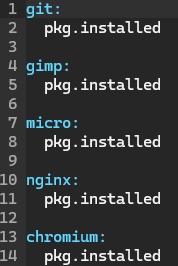
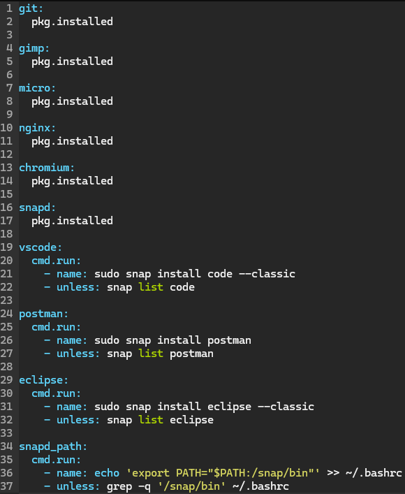

# H7 Oma miniprojekti
Käyn tässä raportissa läpi miniprojektin rakentamisen ja linkitän tähän raporttiin itse projektisivun.

Projektin tarkoituksena on luoda Digital Oceanin pilveen virtuaalinen Master kone, jonka avulla saadaan paikallisille minion -koneille ladattua halutut ohjelmistokehityksen tarpeet helposti, jolloin voin jokaiselle kehitysprojektille helposti luoda omat virtuaalikoneet samoilla asetuksilla ja ohjelmistoilla. Havaitut tarpeelliset ohjelmat ohjelmistokehitystä ajatellen ovat: Git, Gimp, Micro, Nginx, Chromium, VScode, Postman ja Eclipse.

## Lopullinen projekti
Itse lopullinen projektikansio esittelyineen löytyy [täältä.](https://github.com/NicklasHH/Miniprojekti) Tämä raportti on kirjoitettu, jotta voin palata takaisin ajassa tämän projektin rakennusvaiheeseen. 

## Pohjatiedot
Pohjatietoihin ei tulla antamaan tässä raportissa asennusohjeita. Paikalliselle Windows koneelle on asennettu projektissa tarvittavat Virtualbox, Git sekä Vagrant. Master toimii Digital Oceanissa Linuxilla. Masteria ajetaan SSH yhteydellä paikalliselta Windows koneelta. Digital Oceanilla on jo paikallisen koneen ssh avain tallennettuna.

## Muuta huomioitavaa
Koska Master kone on toteutettu pilveen, ei projektin toistaminen tule olemaan pelkkää tiedostojen kopioimista. Pienillä muutoksilla lopputulos voidaan toistaa myös paikallisella tietokoneella, mutta siihen en artikkelissa anna erikseen ohjeita.

## Fyysinen tietokone

- Windows 11 Home
  - Versio: 23H2
- Nvidia rtx 2060 näytönohjain
  - 6 GB muistia
- Intel i7-9750H prosessori
  - 6 ydintä
- 2 x 8GB Ram
- 1000 GB NVMe m.2 SSD
  - Josta vapaana +700Gb
- Viimeisimmät päivitykset ja ajurit asennettuna 18.4.2024

---

## Virtuaalikone Digital Oceanissa

 - Sijainti: Amsterdam
 - OS: Debian 12 x64
 - Droplet type: Basic
 - Ram: 2GB
 - CPU: 1
 - Tallennustila: 50GB
 - Tiedostonsiirtomäärä: 2TB
 - Paikallisen koneen SSH avain oli jo tallennettu Digital Oceaniin, joten lisäsin myös sen kohdalla rastin ruutuun

---

## Digital Oceanin masterin konfigurointi
Ennen osion tekoa, luin vanhan raporttini koskien virtuaalikoneen tekoa Digital Oceanin pilveen (NicklasHH 2024).

1. Avasin paikallisen koneen terminaalin ja yhdistin luomaani virtuaalikoneeseen komennolla `ssh root@178.62.241.242`
2. Asensin palomuurin komennoilla
    >sudo apt-get update  
    >sudo apt-get install ufw  
    >sudo ufw allow 22/tcp  
    >sudo ufw enable  
3. Tein uuden käyttäjän komennoilla
    >sudo adduser masteri  
    >vahva salasana x2  
    >nimenä nicklas  
    >sudo adduser masteri sudo # lisäsin sudo oikeudet  
    - Avasin digital oceanin kautta terminaalin masteri käyttäjälle ja menin polkuun `/home/masteri/.ssh` ja komennolla `nano authorized_keys` avasin editorin, minne lisäsin paikallisen koneeni julkisen avaimen. Testasin vielä ottaa SSH yhteyden komennolla `ssh masteri@178.62.241.242` joka onnistui.
4. ROOT lukitseminen
Lukitsin turvallisuus syistä rootilla sisäänkirjautumisen antamalla komennon `sudo usermod --lock root` ja komennolla `sudoedit /etc/ssh/sshd_config` muokkasin kohtaan *PermitRootLogin:* **no**. Tämän jälkeen testasin vielä tehdyn osion ja yritin ottaa ssh yhteyden komennolla `ssh root@178.62.241.242` joka ei enää toiminut.

5. Asennuksia Masteri pilvikoneelle
    5.1 `sudo apt-get update`  
    5.2 `sudo apt install micro`  
    5.2.1 `echo 'export EDITOR=micro' >> ~/.bashrc` 
    5.2.2 Testasin komennolla `sudoedit /testi`  
    5.3 `sudo apt install curl` 
    5.3.1 Testasin komennolla `curl google.com`  
    5.4 salt masterin asennus  
	  5.4.1 `sudo curl -fsSL -o /etc/apt/keyrings/salt-archive-keyring-2023.gpg https://repo.saltproject.io/salt/py3/debian/12/amd64/SALT-PROJECT-GPG-PUBKEY-2023.gpg`  
    5.4.2 `echo "deb [signed-by=/etc/apt/keyrings/salt-archive-keyring-2023.gpg arch=amd64] https://repo.saltproject.io/salt/py3/debian/12/amd64/latest bookworm main" | sudo tee /etc/apt/sources.list.d/salt.list`  
    5.4.3 `sudo apt-get update`  
    5.4.4 `sudo apt-get install salt-master`  
    5.4.5 `sudo systemctl enable salt-master && sudo systemctl start salt-master`  
    5.4.6 testaus komennolla `sudo salt-call --local grains.items`  

## Paikallisen koneen master
Aloitin osion tekemällä paikalliselle koneelle virtuaalikoneet helpottaakseni tarvittaessa uusien virtuaalikoneiden luontia, joten avasin terminaalin ja tein kansion masteri, jossa annoin komennon `micro vagrantfile` ja kopioin sinne sisällön tiedostosta [vagrantfilekehitykseen](vagrantfilekehitykseen)

1. Annoin komennon `vagrant up` ja asennuksien jälkeen yhdistin master virtuaalikoneeseen komennolla `vagrant ssh master`
2. Micro oli jo asentunut tuossa kehitysvaiheen vagrantfilessä, joten tein siitä oletus editorin komennolla `export EDITOR=micro`
3. Kokeilin saltin toimivuuden komennolla `sudo salt-call --local grains.items`
4. Tein salttia varten hakemiston komennolla `sudo mkdir /srv/salt` ja siirryin sinne `cd /srv/salt`
5. Lähdin kokeilemaan ensimmäisenä, mitkä tarvittavat ohjelmistot onnistuvat suoralla asennuksella ja niitä olivat seuraavat:
   - sudo salt-call --local state.single pkg.installed git  
   - sudo salt-call --local state.single pkg.installed gimp  
   - sudo salt-call --local state.single pkg.installed micro  
   - sudo salt-call --local state.single pkg.installed nginx  
   - sudo salt-call --local state.single pkg.installed chromium  
6. Tein programs kansion salt kansioon ja loin sinne init.sls tiedoston johon lisäsin onnistuneet asennukset.
 

7. Lähdin selvittämään, kuinka saan loput asennukset tehtyä ja yksi tapa tähän oli asentaa snap paketinhallintajärjestelmä (Canonical Ltd 2024). Asensin snapin komennolla `sudo apt install snapd -y` ja asennuksen jälkeen kokeilin vielä saako asennuksen suoritettua saltilla komennolla `sudo salt-call --local state.single pkg.installed snapd`  

8. Snapin asennuksen jälkeen tein loput asennukset:
    >sudo snap install code --classic  
    >sudo snap install postman  
    >sudo snap install eclipse --classic
  
    - Asennuksen jälkeen yritin käynnistää ohjelmia, mutta ne eivät käynnistyneet, joten tarkistin löytyykö se muuttujista komennolla `echo $PATH` ja ei löytynyt. Lisäsin muuttujan listaan komennolla `export PATH="$PATH:/snap/bin"` jonka jälkeen pystyin käynnistämään myös snapilla ladatut ohjelmistot terminaalista.  

9. Näiden asennusten jälkeen päädyin selaamaan saltin dokumentaatiota, jotta löytäisin keinon idempotenttiin koodiin (VMware 2024). Lisäksi katsoin toista salt stack dokumentaatiota, jossa kerrottiin unless komennon tarkistavan, pystyykö jonkin ohjelman ajamaan(VMware 2021). Lisäksi katsoin snapin dokumentaatiota komennolla `man snap` josta löysin list komennon, joka näyttää asennetut ohjelmat. Tein siis init.sls tiedostoon unless osion, jossa hyödynsin snapin list funktiota, joka kertoo onko ohjelma asennettu. Lisäsin tästä myös myös tilan, jos `snap/bin` ei löydy `.bashrc` kansiosta, tehdään se sinne.  

10. Testasin init.sls tiedoston toimivuuden ajamalla tilan paikallisesti komennolla `sudo salt-call --local state.apply programs` joka ei palauttanut virheitä. Toki tässä kohtaa kaikki ohjelmat oli asennettuna, joten testasin ajaa nämä minion1 koneelle. Tätä ennen tuli hyväksyä avaimet, joka onnistui komennolla `sudo salt-key -A` jonka jälkeen ajoin tilat komennolla `sudo salt minion1 state.apply programs` ja 8/9 tiloista asennettiin onnistuneesti. Micro oli asennettu jo testivagrantfilessä, joten tässä kohtaa on ohjelmien asennus paketissa. 

11. Tässä kohtaa tein githubiin oman repositorion masterin tiedostoille. Tein komennolla `ssh-keygen` avaimen ja kopioin sen julkisen osan komennosta ` cat /home/vagrant/.ssh/id_rsa.pub` ja lisäsin sen GitHubiin jonka jälkeen kopioin repositorion kotihakemistoon komennolla `git clone git@github.com:NicklasHH/Master.git`. Kopioin lopuksi vielä tehdn salt tiedostoni tähän kansioon komennolla `cp -r /srv/salt/ /home/vagrant/Master` jonka jälkeen laitoin muutokset githubiin. [Tästä näet kyseisen commitin](https://github.com/NicklasHH/Master/commit/e2830f0ce177bd81f235e88240b313efbbdabda1) 

## Masterille salt githubista
Asensin Masterille gitin komennolla `sudo salt-call --local state.single pkg.installed git` jonka jälkeen tein ja lisäsin ssh avaimen githubiin.
Menin polkuun `srv` ja annoin komennon `sudo git clone https://github.com/NicklasHH/Master.git` joka kloonasi githubista masterille tekemäni repositoryn. Menin Master kansioon, jossa siirsin salt tiedoston komennolla `sudo mv salt ../` ja lopuksi poistin alkuperäisen Master kansion komennolla `sudo rm -r Master`. Tulen lopulliseen esitystiedostoon vaihtamaan tätä kansiorakennetta.

## Ensimmäinen testaus
Käynnistin olemassaolevan Debian12 virtuaalikoneen, jonne annoin komennot
  >sudo apt-get update
  >sudo apt-get -qy install curl
  >mkdir /etc/apt/keyrings
  >sudo curl -fsSL -o /etc/apt/keyrings/salt-archive-keyring-2023.gpg https://repo.saltproject.io/salt/py3/debian/12/amd64/SALT-PROJECT-GPG-PUBKEY-2023.gpg
  >echo "deb [signed-by=/etc/apt/keyrings/salt-archive-keyring-2023.gpg arch=amd64] https://repo.saltproject.io/salt/py3/debian/12/amd64/latest bookworm main" | sudo tee /etc/apt/sources.list.d/salt.list
  >sudo apt-get update
  >sudo apt-get -qy install salt-minion
  >echo "master: 178.62.241.242" | sudo tee /etc/salt/minion
  >sudo systemctl enable salt-minion && sudo systemctl start salt-minion

  - Koska en nähnyt komennolla `sudo salt-key -A` pyyntöjä, avasin masterin portit komennoin `sudo ufw allow 4505/tcp` ja `sudo ufw allow 4506/tcp` ja sain sen jälkeen avain pyynnöt läpi (SaltStack 2016). Tämän jälkeen komento `sudo salt '*' state.apply programs` lähti rullaamaan. Lopputuloksena 9 onnistunutta joista 7 muutettu.

## Vagranfile
Seuraavaksi aloin rakentamaan lopullista vagrantfileä ja koska tarkoitus on käyttää bookwormia, jouduin asentamaan saltin eritavalla. Lisäksi vagrantfileen tuli lisätä masterille oikea IP osoite ja master_port `/etc/salt/minion` tiedostoon. Lisäksi tarkoituksena oli saada toimimaan asennetun virtuaalikoneen työpöytäversio, joka oli täysin uutta minulle.

Sain tehtyä [vagrantfilen minionille](vagrantfile1minion) niin, että minionille kirjautumisen jälkeen tuli antaa komento `sudo systemctl restart salt-minion` jonka jälkeen sain hyväksyttyä avaimen. Testasin vielä komennolla `sudo salt '*' test.ping` jonka jälkeen ajoin tilat komennolla `sudo salt '*' state.apply programs`.

Vielä oli vaikein osuus jäljellä, eli kuinka saan vagrantilla asennettua virtuaalikoneen, jossa on toimiva työpöytä. Löysin videon ja jossa käytettiin ubuntu/bionic64 (Techmaker Studio 2021) joten lähdin testaamaan sitä löytämäni pohjan(niw s.a.) päälle selvittääkseni mitä muutoksia tulee tehdä, jotta tilat saataisiin ajettua.

1. Kopion koko vagrantfilen ja testasin ajaa luodulle virtuaalikoneelle saltin minion komennot:
    >sudo apt-get update
    >sudo apt-get -qy install curl
    >sudo mkdir /etc/apt/keyrings
    >sudo curl -fsSL -o /etc/apt/keyrings/salt-archive-keyring-2023.gpg https://repo.saltproject.io/salt/py3/debian/12/>4/SALT-PROJECT-GPG-PUBKEY-2023.gpg
    >echo "deb [signed-by=/etc/apt/keyrings/salt-archive-keyring-2023.gpg arch=amd64] https://repo.saltproject.io/salt/py3/debian/12/amd64/latest bookworm main" | sudo tee /etc/apt/sources.list.d/salt.list
    >sudo apt-get update
    >sudo apt-get -qy install salt-minion
    >sudoedit /etc/salt/minion <-- tänne lisäsin master osioon ip osoitteen
    >sudo systemctl restart salt-minion

2. Tämän jälkeen hyväksyin masterilla avaimen ja ajoin tilat.
    - micro ei asentunut
    - chromium ei asentunut
    - snap path ei ollut tarpeellinen

3. Testasin onnistuuko näiden asentaminen snapilla ja lopputuloksena oli, että kyllä onnistuu komennoin:
    - sudo snap install chromium
    - sudo snap install micro --classic

4. Tein uuden init.sls tiedoston ubuntun bioniccia varten.
  

5. ässä kohtaa muutin githubin Master repositoriota lisäämällä programsBionic kansion ja muutin alkuperäisen programs kansion programsBookworm. Molempiin kansioihin on omat init.sls tiedostot, jos vielä keksin miten saan bookwormiin käyttöliittymän. [Tästä pääset katsomaan](https://github.com/NicklasHH/Master/)

6. Seuraavaksi oli vielä tehtävä bionicin vagrantfileen asetukset, joilla siihen asentuu automaattisesti salt-minion. käynnistyksen jälkeen annoin komennon `sudo systemctl restart salt-minion` koska avainta ei näkynyt masterilla. Tämän jälkeen ajoin tilat komennolla `sudo salt '*' state.apply programsBionic`. 

## Viimeinen testaus
1. Loin työpöydälle kansion `BionicTest` ja kopioin sinne vagrantfilen

2. Avasin terminaalin ja kirjoitin `BionicTest` kansiossa `vagrant up` ja odotin noin viisi minuuttia asennusten valmistumista.

3. Avasin toisen terminaalin ja yhdistin Master koneeseen komennolla `ssh masteri@178.62.241.242` ja kun bionic oli asentunut, annoin komennon `sudo salt-key -A` ja hyväksyin avaimen.

4. Annoin Masterilla komennon `sudo salt '*' state.apply programsBionic` tilojen ajamiseksi. Tilojen ajaminen vei noin 4 minuuttia.  
 

5. Tarkistin vielä erikseen micron ja gitin toiminnan terminaalin kautta, koska niitä ei näkynyt sovellusluettelossa.  
 

## Lähteet
Canonical Ltd 2024. Install code
on Ubuntu. Luettavissa: https://snapcraft.io/install/code/ubuntu. Luettu: 11.5.2024

NicklasHH 2024. Viikon 4 palautus. Luettavissa: https://github.com/NicklasHH/Linux-palvelimet/blob/master/h4%20Maailma%20kuulee/Palautus4.md. Luettu: 11.5.2024.

niw s.a. Vagrantfile. Luettavissa: https://gist.github.com/niw/bed28f823b4ebd2c504285ff99c1b2c2. Luettu: 12.5.2024.

SaltStack 2016. COMMUNICATION & SECURITY. Luettavissa: https://docs.saltproject.io/en/getstarted/system/communication.html. Luettu: 11.5.2024.

Techmaker Studio 2021. Vagrant Tutorial | How to Setup a Basic Vagrant VM | 10-Minute Tutorials. Katsottavissa: https://www.youtube.com/watch?v=AlRejC0lIGk&ab_channel=TechmakerStudio. Katsottu: 12.5.2024.

VMware 2021. REQUISITES AND OTHER GLOBAL STATE ARGUMENTS. Luettavissa: https://docs.saltproject.io/en/3000/ref/states/requisites.html. Luettu: 11.5.2024.

VMware 2024. SALT.STATES.CMD. Luettavissa: https://docs.saltproject.io/en/latest/ref/states/all/salt.states.cmd.html. Luettu: 11.5.2024.

